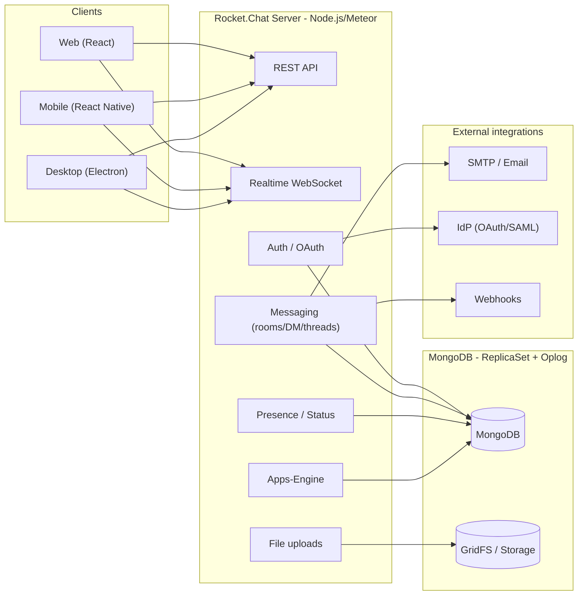
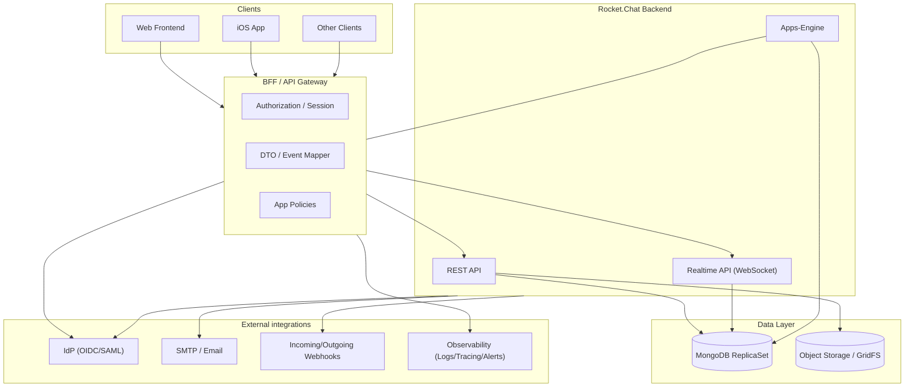

```mermaid
flowchart LR
  subgraph Clients
    W["Web (React)"]
    M["Mobile (React Native)"]
    D["Desktop (Electron)"]
  end

  subgraph Server["Rocket.Chat Server - Node.js/Meteor"]
    API["REST API"]
    RT["Realtime WebSocket"]
    AUTH["Auth / OAuth"]
    MSG["Messaging (rooms/DM/threads)"]
    PRES["Presence / Status"]
    FILES["File uploads"]
    APPS["Apps-Engine"]
  end

  subgraph Data["MongoDB - ReplicaSet + Oplog"]
    DB[("MongoDB")]
    FS[("GridFS / Storage")]
  end

  subgraph External["External integrations"]
    SMTP["SMTP / Email"]
    OAUTH["IdP (OAuth/SAML)"]
    WH["Webhooks"]
  end

  %% Clients -> Server
  W --> API
  W --> RT
  M --> API
  M --> RT
  D --> API
  D --> RT

  %% Server -> Data
  AUTH --> DB
  MSG --> DB
  PRES --> DB
  APPS --> DB
  FILES --> FS

  %% Server -> External
  MSG --> SMTP
  AUTH --> OAUTH
  MSG --> WH
```

```mermaid
flowchart TB
  subgraph Clients
    Web["Web Frontend"]
    IOS["iOS App"]
    Other["Other Clients"]
  end

  subgraph BFF["BFF / API Gateway"]
    AuthZ["Authorization / Session"]
    Mapper["DTO / Event Mapper"]
    Policy["App Policies"]
  end

  subgraph RC["Rocket.Chat Backend"]
    REST["REST API"]
    RT["Realtime API (WebSocket)"]
    APPS["Apps-Engine"]
  end

  subgraph Data["Data Layer"]
    Mongo[("MongoDB ReplicaSet")]
    Obj[("Object Storage / GridFS")]
  end

  subgraph Ext["External integrations"]
    IDP["IdP (OIDC/SAML)"]
    SMTP["SMTP / Email"]
    WH["Incoming/Outgoing Webhooks"]
    OBS["Observability (Logs/Tracing/Alerts)"]
  end

  %% Clients -> BFF
  Web --> BFF
  IOS --> BFF
  Other --> BFF

  %% BFF -> Rocket.Chat
  BFF --> REST
  BFF --> RT
  APPS --- BFF

  %% Backend -> Data
  REST --> Mongo
  RT --> Mongo
  APPS --> Mongo
  REST --> Obj

  %% External
  BFF --> IDP
  RC --> IDP
  RC --> SMTP
  RC --> WH
  BFF --> OBS
```
