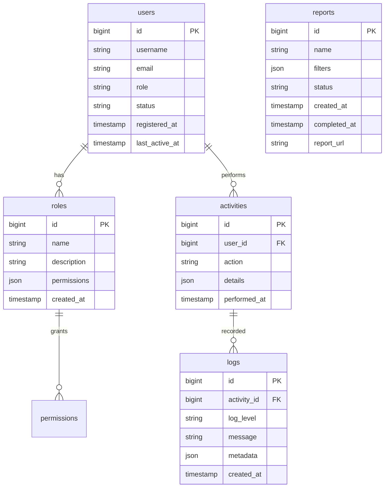

# SnatchTradingChatApp 管理者機能仕様書

## 1. 概要
本ドキュメントは、SnatchTradingChatAppの管理者機能（ユーザー管理、レポート生成、システム設定）に関する詳細仕様を定義します。

## 2. UI/UXデザイン

### 2.1 管理ダッシュボード
- **デザイン**: カード形式の統計情報表示
- **要素**:
  - ユーザー登録数
  - アクティブユーザー数
  - 日次/月次レポート
  - システムステータス表示

### 2.2 ユーザー管理画面
- **デザイン**: テーブル形式
- **要素**:
  - ユーザー名
  - メールアドレス
  - 登録日
  - ステータス（アクティブ/ブロック）
  - 権限変更
  - CSVエクスポートボタン

### 2.3 システム設定画面
- **デザイン**: タブ構成
- **要素**:
  - 一般設定タブ
  - 通知設定タブ
  - セキュリティ設定タブ
  - ロール管理タブ

### 2.4 レポート生成画面
- **デザイン**: グラフ形式の動的レポート
- **要素**:
  - 日次/月次フィルター
  - CSVダウンロード
  - カスタムグラフ作成機能

## 3. 画面遷移フロー

```
1. 管理者ログイン
   └─ 管理ダッシュボード
       ├─ ユーザー管理
       │   ├─ 権限変更
       │   └─ レポート出力
       ├─ システム設定
       │   ├─ 一般設定
       │   ├─ 通知設定
       │   └─ セキュリティ設定
       └─ レポート生成
```

## 4. ER図



## 5. エンドポイント

### 5.1 ユーザー管理

#### GET /api/admin/users
- **説明**: すべてのユーザー取得
- **ヘッダー**: Authorization: Bearer {token}
- **パラメータ**:
  - `page`: number
  - `limit`: number
  - `search`: string
- **レスポンス**:
```json
{
  "users": [{
    "id": 1,
    "username": "admin",
    "email": "admin@example.com",
    "role": "admin",
    "status": "active",
    "registered_at": "2024-01-01T00:00:00Z",
    "last_active_at": "2024-01-01T10:00:00Z"
  }],
  "total": 100,
  "has_more": true
}
```

#### PUT /api/admin/users/{userId}/roles
- **説明**: ユーザーの権限を変更
- **ヘッダー**: Authorization: Bearer {token}
- **リクエスト**:
```json
{
  "role": "user"
}
```

#### DELETE /api/admin/users/{userId}
- **説明**: ユーザーを削除
- **ヘッダー**: Authorization: Bearer {token}

### 5.2 レポート生成

#### GET /api/admin/reports
- **説明**: レポート一覧取得
- **ヘッダー**: Authorization: Bearer {token}
- **パラメータ**:
  - `status`: string
- **レスポンス**:
```json
{
  "reports": [{
    "id": 1,
    "name": "ユーザーアクティビティレポート",
    "status": "completed",
    "created_at": "2024-01-01T12:00:00Z",
    "completed_at": "2024-01-01T12:05:00Z",
    "report_url": "https://example.com/reports/1"
  }]
}
```

#### POST /api/admin/reports
- **説明**: レポート作成
- **ヘッダー**: Authorization: Bearer {token}
- **リクエスト**:
```json
{
  "name": "新規レポート",
  "filters": {
    "date_range": "last_month",
    "user_role": "all"
  }
}
```

### 5.3 システム設定

#### GET /api/admin/settings
- **説明**: システム設定の取得
- **ヘッダー**: Authorization: Bearer {token}

#### PUT /api/admin/settings
- **説明**: システム設定の更新
- **ヘッダー**: Authorization: Bearer {token}
- **リクエスト**:
```json
{
  "general": {
    "site_name": "SnatchTradingChatApp",
    "maintenance_mode": false
  },
  "security": {
    "require_2fa": true
  }
}
```

## 6. 機能構成（階層構造）

```
管理者機能
├── ユーザー管理
│   ├── ユーザー一覧表示
│   ├── 権限変更
│   ├── ユーザー削除
│   ├── CSVエクスポート
│   └── アクティビティ追跡
│
├── レポート管理
│   ├── レポート一覧表示
│   ├── レポート作成
│   ├── 自動レポート
│   └── レポートダウンロード
│
├── システム設定
│   ├── 一般設定
│   ├── 通知設定
│   ├── セキュリティ設定
│   └── ロール管理
│
└── モニタリング
    ├── システムステータス
    ├── アクティビティログ
    ├── パフォーマンスメトリクス
    └── アラート通知
```

## 7. データ管理方針

### 7.1 ユーザーデータ
- 基本情報: PostgreSQLで永続保存
- パスワード: ハッシュ化して保存
- アクティビティログ: 90日間保存

### 7.2 レポート
- 生成済みレポート: 30日間保存（AWS S3）
- 未完了レポート: 24時間で自動削除

### 7.3 設定
- システム設定: PostgreSQLで集中管理
- ロールと権限: 柔軟なJSON形式で保存

## 8. 実装上の注意点

### 8.1 セキュリティ
- 管理者のみアクセス可能なエンドポイント
- レートリミットの実装
- ログイン試行回数の制限

### 8.2 パフォーマンス
- インデックスを使用した高速検索
- キャッシング戦略の実装
- 非同期処理を利用したバッチ操作

### 8.3 実装技術
- **バックエンド**: Node.js + Express
- **データベース**: PostgreSQL
- **認証/認可**: JWT + OAuth2.0
- **フロントエンド**: React + Redux

## 9. エラーハンドリング

### 9.1 ユーザー管理エラー
- `404 Not Found`: ユーザーが見つからない場合
- `403 Forbidden`: 権限が不十分

### 9.2 レポート生成エラー
- `500 Internal Server Error`: レポート生成失敗
- `408 Request Timeout`: 長時間のクエリ実行によるタイムアウト

### 9.3 システム設定エラー
- `400 Bad Request`: 無効な設定値
- `409 Conflict`: 同時編集における競合

## 10. 今後の拡張性

### 10.1 高度なユーザー分析
- コホート分析
- 行動分析
- エンゲージメントトラッキング

### 10.2 カスタマイズ可能な管理機能
- ダッシュボードウィジェット
- ユーザー定義レポート
- 動的ロール管理

### 10.3 自動化と通知
- 自動アラート生成
- 予知保全
- 定期的なシステムバックアップ
