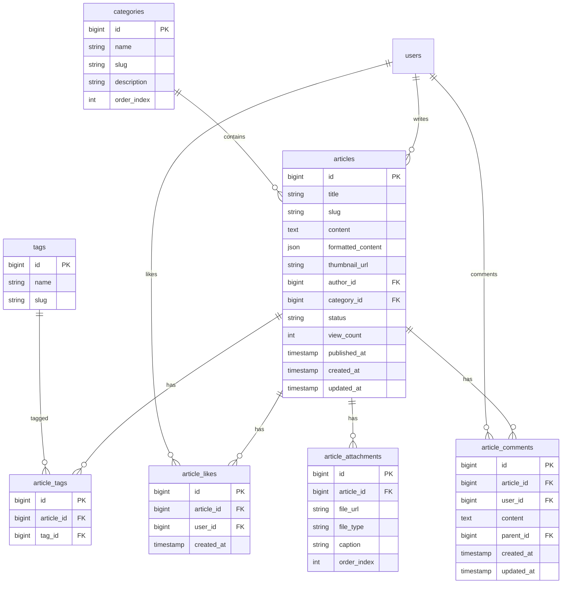

# SnatchTradingChatApp 記事管理機能仕様書

## 1. 概要
本ドキュメントは、SnatchTradingChatAppの記事管理機能（投資記事の作成、編集、公開、閲覧）に関する詳細仕様を定義します。

## 2. UI/UXデザイン

### 2.1 記事一覧画面
- **デザイン**: カード形式のグリッドレイアウト
- **要素**:
  - 記事タイトル
  - サムネイル画像
  - 投稿者情報
  - 投稿日時
  - カテゴリータグ
  - 閲覧数/いいね数

### 2.2 記事作成/編集画面
- **デザイン**: リッチテキストエディタ中心のレイアウト
- **要素**:
  - タイトル入力欄
  - サムネイル画像アップロード
  - カテゴリー選択
  - タグ入力
  - リッチテキストエディタ
  - プレビューボタン
  - 下書き保存/公開ボタン

### 2.3 記事詳細画面
- **デザイン**: 読みやすさを重視したブログ形式
- **要素**:
  - 記事タイトル
  - 投稿者情報
  - 投稿日時/更新日時
  - カテゴリー/タグ
  - 記事本文
  - いいねボタン
  - コメントセクション
  - 関連記事

### 2.4 記事管理画面（管理者用）
- **デザイン**: テーブル形式の管理画面
- **要素**:
  - 記事一覧テーブル
  - ステータスフィルター
  - 一括操作ボタン
  - 公開/非公開切り替え

## 3. 画面遷移フロー

```
1. ホーム画面
   └─ 記事セクション
       ├─ 記事一覧
       │   └─ 記事詳細
       │       ├─ いいね
       │       └─ コメント投稿
       └─ 記事作成（管理者のみ）
           ├─ 下書き保存
           ├─ プレビュー
           └─ 公開
```

## 4. ER図



## 5. エンドポイント

### 5.1 記事閲覧関連

#### GET /api/articles
- **説明**: 記事一覧取得
- **ヘッダー**: Authorization: Bearer {token}
- **パラメータ**:
  - `page`: number (default: 1)
  - `limit`: number (default: 20)
  - `category`: string (optional)
  - `tag`: string (optional)
  - `search`: string (optional)
  - `sort`: string (latest, popular, trending)
- **レスポンス**:
```json
{
  "articles": [{
    "id": 1,
    "title": "2024年の投資戦略",
    "slug": "2024-investment-strategy",
    "excerpt": "記事の要約...",
    "thumbnail_url": "https://...",
    "author": {
      "id": 1,
      "display_name": "管理者",
      "avatar_url": "https://..."
    },
    "category": {
      "id": 1,
      "name": "投資戦略"
    },
    "tags": ["投資", "2024年"],
    "view_count": 150,
    "like_count": 23,
    "comment_count": 5,
    "published_at": "2024-01-01T00:00:00Z"
  }],
  "total": 100,
  "has_more": true
}
```

#### GET /api/articles/{articleId}
- **説明**: 記事詳細取得
- **ヘッダー**: Authorization: Bearer {token}
- **レスポンス**:
```json
{
  "id": 1,
  "title": "2024年の投資戦略",
  "content": "記事本文...",
  "formatted_content": {
    "type": "rich_text",
    "blocks": [...]
  },
  "thumbnail_url": "https://...",
  "author": {
    "id": 1,
    "display_name": "管理者",
    "avatar_url": "https://..."
  },
  "category": {
    "id": 1,
    "name": "投資戦略"
  },
  "tags": ["投資", "2024年"],
  "attachments": [{
    "id": 1,
    "file_url": "https://...",
    "file_type": "image/png",
    "caption": "チャート画像"
  }],
  "view_count": 150,
  "like_count": 23,
  "is_liked": false,
  "published_at": "2024-01-01T00:00:00Z",
  "updated_at": "2024-01-02T00:00:00Z"
}
```

### 5.2 記事作成/編集関連（管理者のみ）

#### POST /api/articles
- **説明**: 記事作成
- **ヘッダー**: Authorization: Bearer {token}
- **リクエスト**:
```json
{
  "title": "新しい記事",
  "content": "記事本文",
  "formatted_content": {...},
  "thumbnail_url": "https://...",
  "category_id": 1,
  "tags": ["タグ1", "タグ2"],
  "status": "draft" // "draft" or "published"
}
```

#### PUT /api/articles/{articleId}
- **説明**: 記事更新
- **ヘッダー**: Authorization: Bearer {token}
- **リクエスト**: 作成と同じ形式

#### DELETE /api/articles/{articleId}
- **説明**: 記事削除
- **ヘッダー**: Authorization: Bearer {token}

#### POST /api/articles/{articleId}/publish
- **説明**: 記事公開
- **ヘッダー**: Authorization: Bearer {token}

#### POST /api/articles/{articleId}/unpublish
- **説明**: 記事非公開化
- **ヘッダー**: Authorization: Bearer {token}

### 5.3 インタラクション関連

#### POST /api/articles/{articleId}/like
- **説明**: 記事にいいね
- **ヘッダー**: Authorization: Bearer {token}

#### DELETE /api/articles/{articleId}/like
- **説明**: いいね取り消し
- **ヘッダー**: Authorization: Bearer {token}

#### GET /api/articles/{articleId}/comments
- **説明**: コメント一覧取得
- **ヘッダー**: Authorization: Bearer {token}
- **パラメータ**:
  - `page`: number
  - `limit`: number

#### POST /api/articles/{articleId}/comments
- **説明**: コメント投稿
- **ヘッダー**: Authorization: Bearer {token}
- **リクエスト**:
```json
{
  "content": "コメント内容",
  "parent_id": null // 返信の場合は親コメントID
}
```

### 5.4 カテゴリー/タグ関連

#### GET /api/categories
- **説明**: カテゴリー一覧取得
- **ヘッダー**: Authorization: Bearer {token}

#### GET /api/tags
- **説明**: タグ一覧取得
- **ヘッダー**: Authorization: Bearer {token}
- **パラメータ**:
  - `search`: string (optional)

### 5.5 画像アップロード

#### POST /api/articles/upload-image
- **説明**: 記事用画像アップロード
- **ヘッダー**: Authorization: Bearer {token}
- **リクエスト**: multipart/form-data
  - `image`: file
- **レスポンス**:
```json
{
  "url": "https://...",
  "width": 1200,
  "height": 800
}
```

## 6. 機能構成（階層構造）

```
記事管理機能
├── 記事閲覧
│   ├── 記事一覧表示
│   │   ├── カテゴリー別表示
│   │   ├── タグ別表示
│   │   └── 検索機能
│   ├── 記事詳細表示
│   ├── 関連記事表示
│   └── 閲覧履歴
│
├── 記事作成/編集（管理者）
│   ├── リッチテキストエディタ
│   │   ├── 見出し/段落
│   │   ├── 太字/斜体/下線
│   │   ├── リスト
│   │   ├── 引用
│   │   ├── コードブロック
│   │   └── リンク
│   ├── メディア管理
│   │   ├── 画像挿入
│   │   ├── グラフ挿入
│   │   └── 動画埋め込み
│   ├── 下書き保存
│   ├── プレビュー
│   └── 公開管理
│
├── インタラクション
│   ├── いいね機能
│   ├── コメント機能
│   │   ├── コメント投稿
│   │   ├── 返信
│   │   └── コメント削除
│   └── シェア機能
│
└── 分析（管理者）
    ├── 閲覧数統計
    ├── エンゲージメント分析
    └── 人気記事ランキング
```

## 7. データ管理方針

### 7.1 記事データ
- 記事本文: PostgreSQLで永続化
- 下書き: 自動保存（5秒ごと）
- 画像/メディア: S3/CloudStorageに保存

### 7.2 キャッシュ戦略
- 記事一覧: Redisで5分間キャッシュ
- 記事詳細: CDNでキャッシュ
- 人気記事: 1時間ごとに再計算

### 7.3 検索インデックス
- 全文検索: PostgreSQL全文検索機能
- タグ/カテゴリー: インデックス付与

## 8. 実装上の注意点

### 8.1 SEO対策
- メタタグの動的生成
- 構造化データ（JSON-LD）
- サイトマップ自動生成
- OGP対応

### 8.2 パフォーマンス最適化
- 画像の遅延読み込み
- 無限スクロール実装
- 記事本文の段階的読み込み

### 8.3 実装技術
- **リッチテキストエディタ**: TipTap or Quill
- **画像処理**: Sharp（リサイズ、最適化）
- **マークダウン処理**: marked + DOMPurify
- **構文ハイライト**: Prism.js
- **SEO**: Next.js SEO対応

## 9. エラーハンドリング

### 9.1 作成/編集エラー
- 自動保存失敗時の復旧機能
- 画像アップロード失敗時の再試行
- 同時編集の検出と警告

### 9.2 閲覧エラー
- 記事が見つからない場合の404ページ
- 権限不足時の適切なメッセージ

### 9.3 バリデーション
- タイトル: 最大100文字
- 本文: 最大50,000文字
- 画像: 最大5MB、対応形式（JPEG, PNG, WebP）

## 10. 今後の拡張性

### 10.1 高度な編集機能
- 共同編集機能
- バージョン管理
- AIによる文章校正

### 10.2 収益化機能
- 有料記事設定
- メンバーシップ限定記事
- 投げ銭機能

### 10.3 外部連携
- SNSへの自動投稿
- メールマガジン連携
- RSSフィード生成
