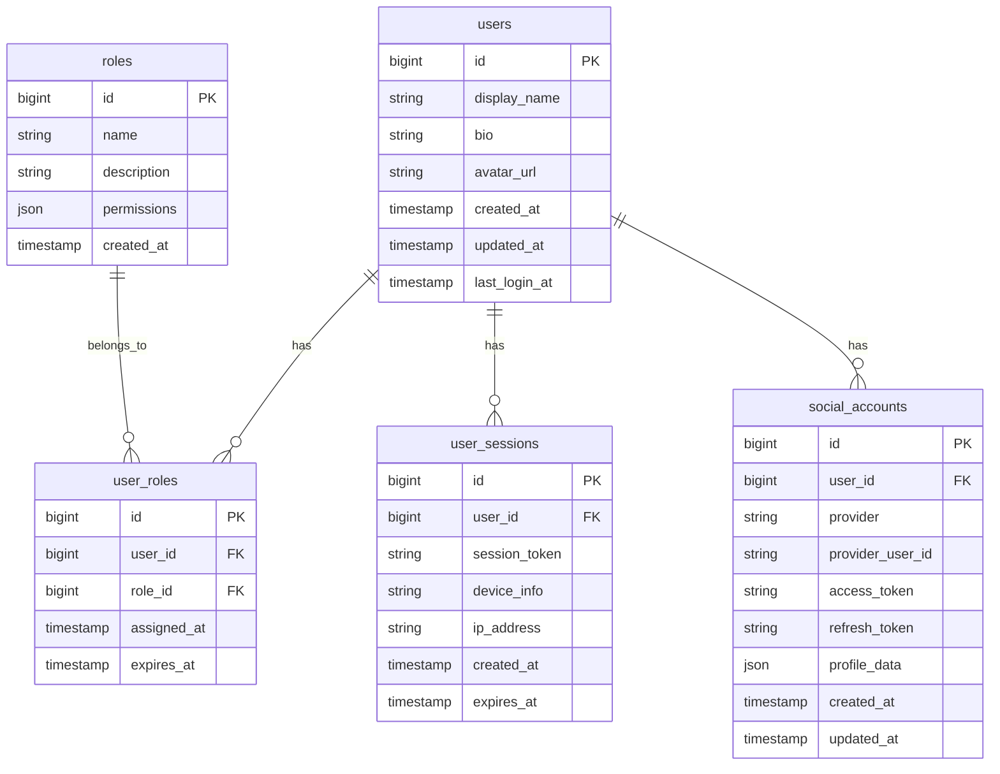

# SnatchTradingChatApp 認証・アカウント管理機能仕様書

## 1. 概要
本ドキュメントは、SnatchTradingChatAppの認証・アカウント管理機能に関する詳細仕様を定義します。

## 2. UI/UXデザイン

### 2.1 ログイン画面
- **デザイン**: モダンでシンプルなデザイン
- **要素**:
  - アプリロゴ
  - X（Twitter）でログインボタン
  - 利用規約・プライバシーポリシーへのリンク

### 2.2 プロフィール画面
- **デザイン**: カード形式のレイアウト
- **要素**:
  - プロフィール画像（編集可能）
  - 表示名（編集可能）
  - 自己紹介（編集可能）
  - X（Twitter）アカウント情報
  - アカウント作成日
  - 最終ログイン日時

### 2.3 権限管理画面（管理者のみ）
- **デザイン**: テーブル形式
- **要素**:
  - ユーザー一覧
  - 権限レベル選択ドロップダウン
  - 保存ボタン

## 3. 画面遷移フロー

```
1. アプリ起動
   ├─ 未認証 → ログイン画面
   │   └─ X認証 → OAuth認証フロー → ホーム画面
   └─ 認証済み → ホーム画面
       └─ 設定 → アカウント設定
           ├─ プロフィール編集
           └─ X連携管理
```

## 4. ER図



## 5. エンドポイント

### 5.1 認証関連

#### POST /api/auth/login/twitter
- **説明**: X（Twitter）OAuth認証開始
- **リクエスト**: なし
- **レスポンス**:
```json
{
  "redirect_url": "https://twitter.com/oauth/authorize?..."
}
```

#### GET /api/auth/callback/twitter
- **説明**: OAuth認証コールバック
- **パラメータ**: 
  - `code`: string (OAuth認証コード)
  - `state`: string (CSRF対策用)
- **レスポンス**:
```json
{
  "user": {
    "id": 1,
    "display_name": "ユーザー名",
    "avatar_url": "https://...",
    "role": "user"
  },
  "access_token": "jwt_token",
  "refresh_token": "refresh_token"
}
```

#### POST /api/auth/logout
- **説明**: ログアウト
- **ヘッダー**: Authorization: Bearer {token}
- **レスポンス**:
```json
{
  "message": "Successfully logged out"
}
```

#### POST /api/auth/refresh
- **説明**: トークンリフレッシュ
- **リクエスト**:
```json
{
  "refresh_token": "refresh_token"
}
```
- **レスポンス**:
```json
{
  "access_token": "new_jwt_token",
  "refresh_token": "new_refresh_token"
}
```

### 5.2 アカウント管理関連

#### GET /api/users/me
- **説明**: 自分のプロフィール取得
- **ヘッダー**: Authorization: Bearer {token}
- **レスポンス**:
```json
{
  "id": 1,
  "display_name": "ユーザー名",
  "bio": "自己紹介",
  "avatar_url": "https://...",
  "role": "user",
  "created_at": "2024-01-01T00:00:00Z",
  "last_login_at": "2024-01-02T00:00:00Z",
  "social_accounts": [{
    "provider": "twitter",
    "username": "@username"
  }]
}
```

#### PUT /api/users/me
- **説明**: プロフィール更新
- **ヘッダー**: Authorization: Bearer {token}
- **リクエスト**:
```json
{
  "display_name": "新しい名前",
  "bio": "新しい自己紹介"
}
```

#### POST /api/users/me/avatar
- **説明**: アバター画像アップロード
- **ヘッダー**: Authorization: Bearer {token}
- **リクエスト**: multipart/form-data
  - `avatar`: file

### 5.3 権限管理関連（管理者のみ）

#### GET /api/admin/users
- **説明**: ユーザー一覧取得
- **ヘッダー**: Authorization: Bearer {token}
- **パラメータ**:
  - `page`: number
  - `limit`: number
  - `search`: string (optional)

#### PUT /api/admin/users/{userId}/role
- **説明**: ユーザー権限変更
- **ヘッダー**: Authorization: Bearer {token}
- **リクエスト**:
```json
{
  "role": "admin" // "admin", "user", "guest"
}
```

## 6. 機能構成（階層構造）

```
認証・アカウント管理
├── 認証機能
│   ├── X（Twitter）OAuth認証
│   ├── JWTトークン管理
│   ├── セッション管理
│   └── ログアウト
│
├── アカウント管理
│   ├── プロフィール表示
│   ├── プロフィール編集
│   ├── アバター管理
│   └── ソーシャルアカウント連携
│
└── 権限管理
    ├── ロールベースアクセス制御（RBAC）
    ├── 権限チェックミドルウェア
    └── 管理者による権限変更
```

## 7. データ管理方針

### 7.1 認証情報
- JWTトークン: メモリ/LocalStorageで管理
- リフレッシュトークン: HttpOnly Cookieで管理
- セッション情報: Redisで管理（有効期限付き）

### 7.2 ユーザーデータ
- 基本情報: PostgreSQLで永続化
- アバター画像: S3/CloudStorageに保存
- キャッシュ: Redisで高速アクセス

### 7.3 セキュリティ
- パスワード: 使用しない（OAuth認証のみ）
- トークン: 定期的なローテーション
- セッション: 異常検知による自動無効化

## 8. 実装上の注意点

### 8.1 セキュリティ考慮事項
- CSRF対策: stateパラメータの検証
- XSS対策: 入力値のサニタイズ
- セッション固定攻撃対策: ログイン時のセッションID再生成

### 8.2 パフォーマンス考慮事項
- ユーザー情報のキャッシュ戦略
- OAuth認証の非同期処理
- アバター画像の最適化（リサイズ、圧縮）

### 8.3 実装技術
- **バックエンド**: Node.js + Express.js
- **認証ライブラリ**: Passport.js
- **JWT管理**: jsonwebtoken
- **データベース**: PostgreSQL + Prisma ORM
- **キャッシュ**: Redis
- **ファイルストレージ**: AWS S3 or Google Cloud Storage

## 9. エラーハンドリング

### 9.1 認証エラー
- `401 Unauthorized`: 未認証
- `403 Forbidden`: 権限不足
- `419 Token Expired`: トークン期限切れ

### 9.2 バリデーションエラー
- `400 Bad Request`: 入力値不正
- `413 Payload Too Large`: ファイルサイズ超過

### 9.3 外部サービスエラー
- `503 Service Unavailable`: X API一時的利用不可
- リトライ処理の実装

## 10. 今後の拡張性

### 10.1 追加認証プロバイダ
- Google認証
- Apple認証
- メールアドレス認証

### 10.2 高度なセキュリティ機能
- 2段階認証（2FA）
- 生体認証対応
- 不正ログイン検知

### 10.3 プロフィール機能拡張
- プロフィールの公開/非公開設定
- フォロー/フォロワー機能
- 実績・バッジシステム
