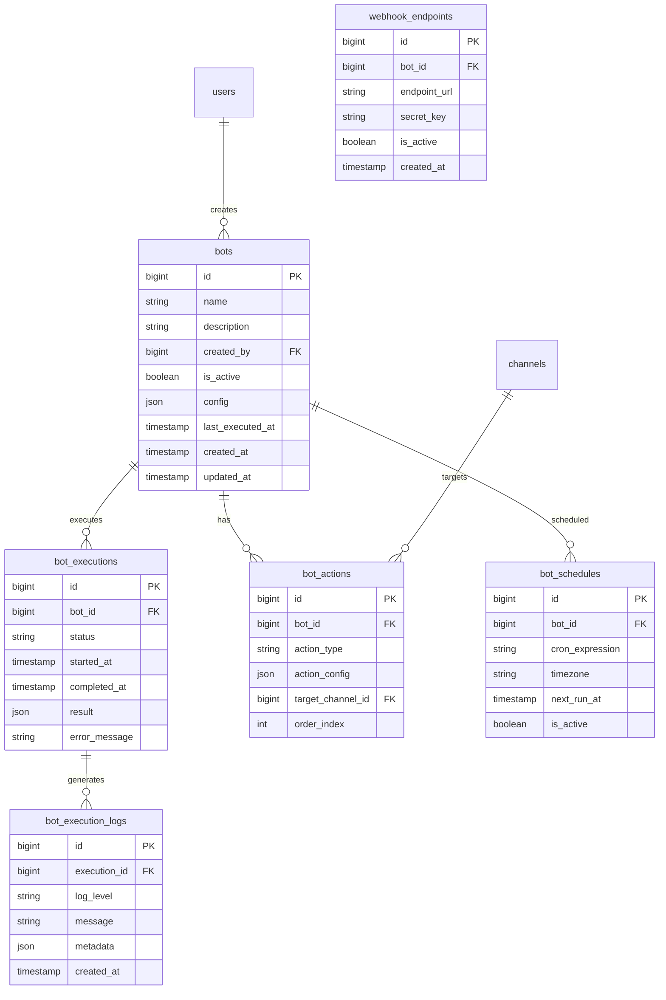

# SnatchTradingChatApp ボット機能仕様書

## 1. 概要
本ドキュメントは、SnatchTradingChatAppのボット機能（自動投稿、投資情報取得、スクリプト実行）に関する詳細仕様を定義します。

## 2. UI/UXデザイン

### 2.1 ボット管理画面
- **デザイン**: ダッシュボード形式
- **要素**:
  - ボット一覧（カード形式）
  - ボットステータス（稼働中/停止中）
  - 実行履歴グラフ
  - 新規ボット作成ボタン

### 2.2 ボット作成/編集画面
- **デザイン**: ステップ形式のウィザード
- **要素**:
  - ボット名/説明入力
  - トリガー設定（cron式）
  - アクション設定
  - テスト実行ボタン
  - 保存/有効化ボタン

### 2.3 ボット詳細画面
- **デザイン**: タブ形式
- **要素**:
  - 基本情報タブ
  - 実行履歴タブ
  - ログタブ
  - 設定タブ

### 2.4 実行履歴画面
- **デザイン**: タイムライン形式
- **要素**:
  - 実行日時
  - 実行結果（成功/失敗）
  - 実行時間
  - 出力内容プレビュー

## 3. 画面遷移フロー

```
1. 管理者ホーム
   └─ ボット管理
       ├─ ボット一覧
       │   └─ ボット詳細
       │       ├─ 編集
       │       ├─ 実行履歴
       │       └─ ログ確認
       └─ 新規ボット作成
           ├─ 基本設定
           ├─ トリガー設定
           ├─ アクション設定
           └─ テスト/保存
```

## 4. ER図



## 5. エンドポイント

### 5.1 ボット管理関連

#### GET /api/bots
- **説明**: ボット一覧取得
- **ヘッダー**: Authorization: Bearer {token}
- **レスポンス**:
```json
{
  "bots": [{
    "id": 1,
    "name": "市場情報ボット",
    "description": "毎朝9時に市場情報を投稿",
    "is_active": true,
    "last_executed_at": "2024-01-01T09:00:00Z",
    "next_run_at": "2024-01-02T09:00:00Z",
    "created_by": {
      "id": 1,
      "display_name": "管理者"
    },
    "statistics": {
      "total_executions": 100,
      "success_rate": 98.0,
      "average_execution_time": 2.5
    }
  }]
}
```

#### POST /api/bots
- **説明**: ボット作成
- **ヘッダー**: Authorization: Bearer {token}
- **リクエスト**:
```json
{
  "name": "新規ボット",
  "description": "ボットの説明",
  "config": {
    "retry_on_failure": true,
    "max_retries": 3,
    "timeout": 30
  }
}
```

#### GET /api/bots/{botId}
- **説明**: ボット詳細取得
- **ヘッダー**: Authorization: Bearer {token}

#### PUT /api/bots/{botId}
- **説明**: ボット更新
- **ヘッダー**: Authorization: Bearer {token}

#### DELETE /api/bots/{botId}
- **説明**: ボット削除
- **ヘッダー**: Authorization: Bearer {token}

#### POST /api/bots/{botId}/activate
- **説明**: ボット有効化
- **ヘッダー**: Authorization: Bearer {token}

#### POST /api/bots/{botId}/deactivate
- **説明**: ボット無効化
- **ヘッダー**: Authorization: Bearer {token}

### 5.2 スケジュール関連

#### POST /api/bots/{botId}/schedules
- **説明**: スケジュール設定
- **ヘッダー**: Authorization: Bearer {token}
- **リクエスト**:
```json
{
  "cron_expression": "0 9 * * *",
  "timezone": "Asia/Tokyo"
}
```

#### PUT /api/bots/{botId}/schedules/{scheduleId}
- **説明**: スケジュール更新
- **ヘッダー**: Authorization: Bearer {token}

### 5.3 アクション関連

#### POST /api/bots/{botId}/actions
- **説明**: アクション追加
- **ヘッダー**: Authorization: Bearer {token}
- **リクエスト**:
```json
{
  "action_type": "post_message",
  "action_config": {
    "content": "市場が開きました",
    "channel_id": "123"
  },
  "order_index": 1
}
```

#### PUT /api/bots/{botId}/actions/{actionId}
- **説明**: アクション更新
- **ヘッダー**: Authorization: Bearer {token}

#### DELETE /api/bots/{botId}/actions/{actionId}
- **説明**: アクション削除
- **ヘッダー**: Authorization: Bearer {token}

### 5.4 実行関連

#### POST /api/bots/{botId}/execute
- **説明**: ボット手動実行
- **ヘッダー**: Authorization: Bearer {token}
- **リクエスト**:
```json
{
  "dry_run": false
}
```

#### GET /api/bots/{botId}/executions
- **説明**: 実行履歴取得
- **ヘッダー**: Authorization: Bearer {token}
- **パラメータ**:
  - `page`: number
  - `limit`: number
  - `status`: string (success, failed, running)

#### GET /api/bots/{botId}/executions/{executionId}
- **説明**: 実行詳細取得
- **ヘッダー**: Authorization: Bearer {token}

#### GET /api/bots/{botId}/executions/{executionId}/logs
- **説明**: 実行ログ取得
- **ヘッダー**: Authorization: Bearer {token}

### 5.5 Webhook関連

#### POST /api/bots/{botId}/webhooks
- **説明**: Webhookエンドポイント作成
- **ヘッダー**: Authorization: Bearer {token}
- **レスポンス**:
```json
{
  "endpoint_url": "https://api.example.com/webhooks/abc123",
  "secret_key": "webhook_secret_key"
}
```

## 6. 機能構成（階層構造）

```
ボット機能
├── ボット管理
│   ├── ボット一覧表示
│   ├── ボット作成
│   ├── ボット編集
│   ├── ボット削除
│   └── ボット有効/無効化
│
├── スケジュール管理
│   ├── Cron式設定
│   ├── タイムゾーン設定
│   ├── 実行間隔設定
│   └── 次回実行時刻計算
│
├── アクション設定
│   ├── メッセージ投稿
│   │   ├── テキスト投稿
│   │   ├── 画像付き投稿
│   │   └── テンプレート投稿
│   ├── 情報取得
│   │   ├── 市場データ取得
│   │   ├── ニュース取得
│   │   └── 為替レート取得
│   ├── データ処理
│   │   ├── データ集計
│   │   ├── フォーマット変換
│   │   └── 条件分岐
│   └── 外部連携
│       ├── API呼び出し
│       ├── Webhook送信
│       └── データベース操作
│
├── 実行管理
│   ├── 自動実行
│   ├── 手動実行
│   ├── テスト実行
│   └── 実行キャンセル
│
├── モニタリング
│   ├── 実行履歴
│   ├── エラー監視
│   ├── パフォーマンス分析
│   └── アラート通知
│
└── テンプレート
    ├── 市場情報ボット
    ├── ニュース配信ボット
    ├── 統計レポートボット
    └── カスタムボット
```

## 7. データ管理方針

### 7.1 ボット設定
- 設定情報: PostgreSQLで永続化
- 実行スケジュール: Cronジョブとして管理
- 一時データ: Redisでキャッシュ

### 7.2 実行管理
- ジョブキュー: Bull (Redis-based)
- 実行ログ: PostgreSQL（30日間保存）
- メトリクス: Prometheus形式で収集

### 7.3 外部データ
- APIレスポンス: 一時的にRedisにキャッシュ
- 取得データ: 必要に応じてPostgreSQLに保存

## 8. 実装上の注意点

### 8.1 信頼性
- リトライ機能の実装
- タイムアウト処理
- エラーハンドリング
- デッドロック回避

### 8.2 セキュリティ
- APIキーの暗号化保存
- Webhook署名検証
- 実行権限の制御
- サンドボックス環境での実行

### 8.3 実装技術
- **ジョブスケジューラー**: node-cron
- **ジョブキュー**: Bull
- **外部API連携**: axios + retry
- **テンプレートエンジン**: Handlebars
- **ログ管理**: Winston
- **メトリクス**: Prometheus client

## 9. エラーハンドリング

### 9.1 実行エラー
- API接続エラー: 自動リトライ（最大3回）
- タイムアウト: 30秒でキャンセル
- データ処理エラー: ログに記録して続行

### 9.2 設定エラー
- 無効なCron式: バリデーションエラー
- 存在しないチャンネル: 実行時エラー
- 権限不足: 403エラー

### 9.3 リソース制限
- 実行時間上限: 5分
- メモリ使用量上限: 512MB
- API呼び出し回数: 100回/実行

## 10. 今後の拡張性

### 10.1 AI連携
- ChatGPT連携による自動要約
- 感情分析による投稿内容調整
- 予測モデルによる投資提案

### 10.2 高度な自動化
- 条件付き実行（IF-THEN-ELSE）
- 並列実行
- ワークフロー連携

### 10.3 分析機能
- ボットパフォーマンスダッシュボード
- ROI計算
- A/Bテスト機能
