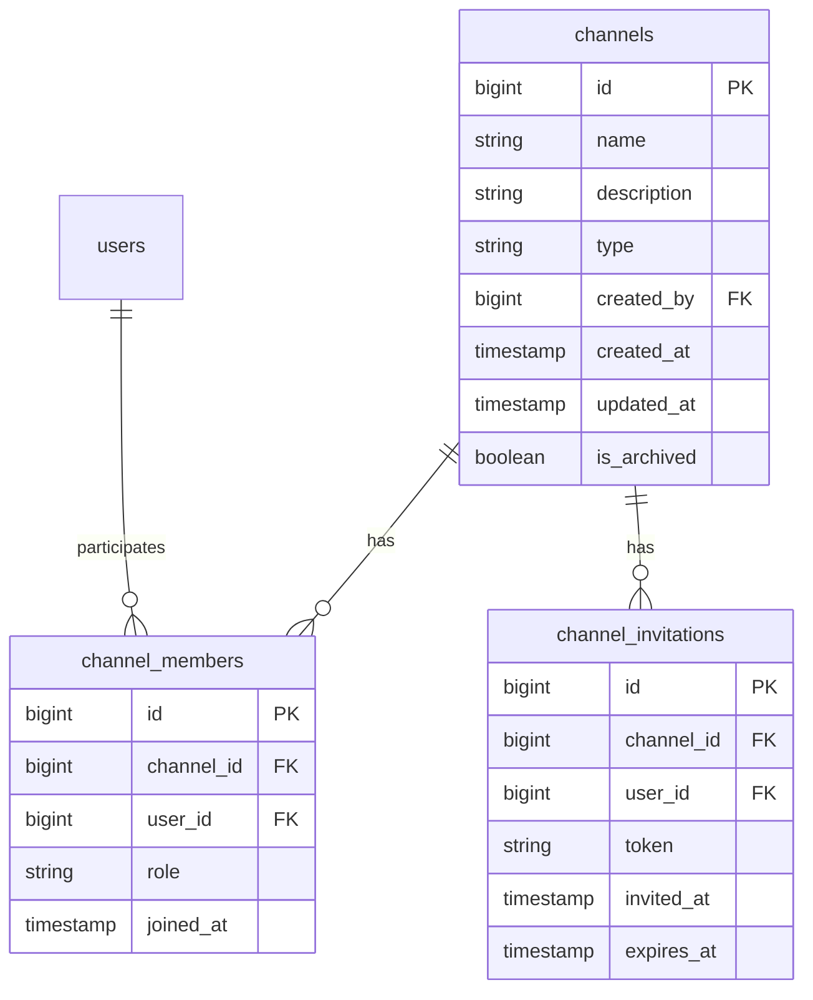

# SnatchTradingChatApp チャンネル管理機能仕様書

## 1. 概要
本ドキュメントは、SnatchTradingChatAppのチャンネル管理機能に関する詳細仕様を定義します。

## 2. UI/UXデザイン

### 2.1 チャンネルリスト画面
- **デザイン**: 簡潔なリスト形式
- **要素**:
  - チャンネル名
  - チャンネル説明
  - 参加者数
  - 新規チャンネル作成ボタン

### 2.2 チャンネル詳細画面
- **デザイン**: タブ構成
- **要素**:
  - チャンネル情報タブ
  - 参加者リストタブ
  - 設定タブ（管理者のみ）

### 2.3 新規チャンネル作成画面
- **デザイン**: フォーム形式
- **要素**:
  - チャンネル名入力欄
  - チャンネル説明入力欄
  - 作成ボタン

## 3. 画面遷移フロー

```
1. ホーム画面
   └─ チャンネルリスト選択
       ├─ チャンネル参加
       ├─ 新規チャンネル作成
       └─ チャンネル詳細
           ├─ チャンネル情報表示
           └─ 参加者管理（管理者のみ）
```

## 4. ER図



## 5. エンドポイント

### 5.1 チャンネル関連

#### GET /api/channels
- **説明**: すべてのチャンネル取得
- **ヘッダー**: Authorization: Bearer {token}
- **レスポンス**:
```json
{
  "channels": [{
    "id": "123",
    "name": "テックトーク",
    "description": "技術関連の話題",
    "type": "public",
    "created_by": 1,
    "created_at": "2024-01-01T00:00:00Z"
  }],
  "has_more": true
}
```

#### POST /api/channels
- **説明**: 新しいチャンネルの作成
- **ヘッダー**: Authorization: Bearer {token}
- **リクエスト**:
```json
{
  "name": "新規チャンネル",
  "description": "チャンネルの説明",
  "type": "public" // "public" or "private"
}
```

#### GET /api/channels/{channelId}
- **説明**: 特定のチャンネル情報取得
- **ヘッダー**: Authorization: Bearer {token}

#### PUT /api/channels/{channelId}
- **説明**: チャンネル情報更新
- **ヘッダー**: Authorization: Bearer {token}
- **リクエスト**:
```json
{
  "name": "更新後のチャンネル名",
  "description": "更新後の説明"
}
```

#### DELETE /api/channels/{channelId}
- **説明**: チャンネルの削除/アーカイブ
- **ヘッダー**: Authorization: Bearer {token}

### 5.2 メンバー関連

#### POST /api/channels/{channelId}/members
- **説明**: チャンネルへメンバーを追加
- **ヘッダー**: Authorization: Bearer {token}
- **リクエスト**:
```json
{
  "user_id": 2,
  "role": "member" // "admin", "member"
}
```

#### DELETE /api/channels/{channelId}/members/{userId}
- **説明**: チャンネルからメンバーを削除
- **ヘッダー**: Authorization: Bearer {token}

### 5.3 招待関連

#### POST /api/channels/{channelId}/invite
- **説明**: メンバーへの招待リンク生成
- **ヘッダー**: Authorization: Bearer {token}
- **リクエスト**:
```json
{
  "user_id": 3
}
```
- **レスポンス**:
```json
{
  "invitation_link": "https://example.com/invite?token=abcd1234"
}
```

### 5.4 チャンネル制御

#### POST /api/channels/{channelId}/archive
- **説明**: チャンネルをアーカイブする
- **ヘッダー**: Authorization: Bearer {token}

## 6. 機能構成（階層構造）

```
チャンネル管理機能
├── チャンネル閲覧
│   ├── すべてのチャンネル表示
│   ├── 登録チャンネルのみ表示
│   └── チャンネル検索
│
├── チャンネル作成
│   └── 新規チャンネルの作成
│
├── チャンネル設定
│   ├── 名称/説明の編集
│   └── チャンネル削除
│
├── メンバー管理
│   ├── メンバー追加
│   ├── メンバー削除
│   └── メンバー権限変更
│
└── 招待管理
    ├── 招待リンク生成
    └── 招待の送信
```

## 7. データ管理方針

### 7.1 チャンネルデータ
- 基本情報: PostgreSQLでの保存
- アーカイブチャンネルは標準のフラグで管理

### 7.2 メンバーデータ
- メンバーシップ情報: PostgreSQLで永続化
- 参加日、権限情報を含む

### 7.3 招待データ
- 招待トークン: 一意のトークンを生成しRedisに保存
- 招待期限: Redis上でTTL管理

## 8. 実装上の注意点

### 8.1 パフォーマンス最適化
- 多くのチャンネルを持つユーザーに対してのパフォーマンスチューニング
- キャッシュを使用してのレスポンス短縮

### 8.2 セキュリティ
- 招待リンクへのアクセス制御
- 不正アクセスの監視

### 8.3 実装技術
- **バックエンド**: Node.js + Express
- **認証/認可**: OAuth2.0 + Passport.js
- **データベース**: PostgreSQL
- **キャッシュサーバー**: Redis

## 9. エラーハンドリング

### 9.1 チャンネル管理エラー
- `404 Not Found`: チャンネルが存在しない
- `403 Forbidden`: チャンネル管理権限がない

### 9.2 メンバー管理エラー
- `400 Bad Request`: 不正なユーザーID
- `409 Conflict`: 重複するメンバー

### 9.3 招待エラー
- `500 Internal Server Error`: 招待トークン生成失敗
- `410 Gone`: 招待リンク期限切れ

## 10. 今後の拡張性

### 10.1 ダイナミックチャンネル設定
- カスタム役割/権限設定
- チャンネルごとの個別設定

### 10.2 自動招待機能
- カレンダー連携による自動招待
- グループ基準の招待機能

### 10.3 統計/分析
- チャンネルの使用状況分析
- メンバーのアクティビティレポート


