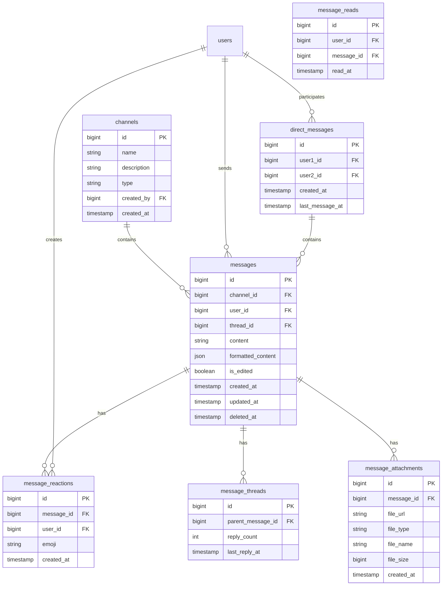

# SnatchTradingChatApp チャット機能仕様書

## 1. 概要
本ドキュメントは、SnatchTradingChatAppのチャット機能（メッセージ送受信、リアクション、スレッド、DM）に関する詳細仕様を定義します。

## 2. UI/UXデザイン

### 2.1 チャット画面
- **デザイン**: Slack/Discord風のモダンなチャットUI
- **レイアウト**:
  - 左サイドバー: チャンネル一覧、DM一覧
  - 中央: メッセージエリア
  - 右サイドバー: スレッド表示（オプション）

### 2.2 メッセージ入力エリア
- **要素**:
  - リッチテキストエディタ
  - ファイル添付ボタン
  - 絵文字ピッカー
  - 送信ボタン
  - メンション補完

### 2.3 メッセージ表示
- **要素**:
  - ユーザーアバター
  - ユーザー名
  - タイムスタンプ
  - メッセージ本文
  - リアクションボタン
  - スレッド返信ボタン
  - その他メニュー（編集、削除等）

### 2.4 スレッド表示
- **デザイン**: 右サイドパネルまたはモーダル
- **要素**:
  - 元メッセージ
  - 返信一覧
  - 返信入力エリア

## 3. 画面遷移フロー

```
1. ホーム画面
   └─ チャンネル選択
       ├─ メッセージ一覧表示
       │   ├─ メッセージ送信
       │   ├─ リアクション追加
       │   └─ スレッド開始
       │       └─ スレッド内返信
       └─ DM選択
           └─ プライベートチャット
```

## 4. ER図



## 5. エンドポイント

### 5.1 メッセージ関連

#### GET /api/channels/{channelId}/messages
- **説明**: チャンネルのメッセージ取得
- **ヘッダー**: Authorization: Bearer {token}
- **パラメータ**:
  - `limit`: number (default: 50)
  - `before`: string (message_id)
  - `after`: string (message_id)
- **レスポンス**:
```json
{
  "messages": [{
    "id": "123",
    "content": "メッセージ内容",
    "formatted_content": {
      "type": "rich_text",
      "blocks": [...]
    },
    "user": {
      "id": 1,
      "display_name": "ユーザー名",
      "avatar_url": "https://..."
    },
    "channel_id": "456",
    "reactions": [{
      "emoji": "👍",
      "count": 3,
      "users": [1, 2, 3]
    }],
    "thread": {
      "reply_count": 5,
      "last_reply_at": "2024-01-01T00:00:00Z"
    },
    "attachments": [{
      "id": "789",
      "file_url": "https://...",
      "file_type": "image/png",
      "file_name": "screenshot.png"
    }],
    "created_at": "2024-01-01T00:00:00Z",
    "updated_at": null
  }],
  "has_more": true
}
```

#### POST /api/channels/{channelId}/messages
- **説明**: メッセージ送信
- **ヘッダー**: Authorization: Bearer {token}
- **リクエスト**:
```json
{
  "content": "メッセージ内容",
  "formatted_content": {
    "type": "rich_text",
    "blocks": [...]
  },
  "thread_id": "123" // スレッドへの返信の場合
}
```

#### PUT /api/messages/{messageId}
- **説明**: メッセージ編集
- **ヘッダー**: Authorization: Bearer {token}
- **リクエスト**:
```json
{
  "content": "編集後のメッセージ",
  "formatted_content": {...}
}
```

#### DELETE /api/messages/{messageId}
- **説明**: メッセージ削除
- **ヘッダー**: Authorization: Bearer {token}

### 5.2 リアクション関連

#### POST /api/messages/{messageId}/reactions
- **説明**: リアクション追加
- **ヘッダー**: Authorization: Bearer {token}
- **リクエスト**:
```json
{
  "emoji": "👍"
}
```

#### DELETE /api/messages/{messageId}/reactions/{emoji}
- **説明**: リアクション削除
- **ヘッダー**: Authorization: Bearer {token}

### 5.3 スレッド関連

#### GET /api/messages/{messageId}/thread
- **説明**: スレッドの返信取得
- **ヘッダー**: Authorization: Bearer {token}
- **パラメータ**:
  - `limit`: number
  - `offset`: number

#### POST /api/messages/{messageId}/thread
- **説明**: スレッドに返信
- **ヘッダー**: Authorization: Bearer {token}
- **リクエスト**:
```json
{
  "content": "スレッドへの返信",
  "formatted_content": {...}
}
```

### 5.4 ダイレクトメッセージ関連

#### GET /api/direct-messages
- **説明**: DM一覧取得
- **ヘッダー**: Authorization: Bearer {token}

#### POST /api/direct-messages
- **説明**: DM開始
- **ヘッダー**: Authorization: Bearer {token}
- **リクエスト**:
```json
{
  "user_id": 2
}
```

#### GET /api/direct-messages/{dmId}/messages
- **説明**: DMのメッセージ取得
- **ヘッダー**: Authorization: Bearer {token}

### 5.5 ファイルアップロード

#### POST /api/upload
- **説明**: ファイルアップロード
- **ヘッダー**: Authorization: Bearer {token}
- **リクエスト**: multipart/form-data
  - `file`: file
  - `type`: string (message_attachment)

### 5.6 WebSocket接続

#### WS /ws/chat
- **説明**: リアルタイムメッセージ配信
- **認証**: URLパラメータでトークン送信
- **イベント**:
  - `message:new`: 新規メッセージ
  - `message:update`: メッセージ更新
  - `message:delete`: メッセージ削除
  - `reaction:add`: リアクション追加
  - `reaction:remove`: リアクション削除
  - `typing:start`: タイピング開始
  - `typing:stop`: タイピング終了

## 6. 機能構成（階層構造）

```
チャット機能
├── メッセージ機能
│   ├── メッセージ送信
│   │   ├── テキストメッセージ
│   │   ├── リッチテキスト（書式設定）
│   │   └── メンション機能
│   ├── メッセージ編集
│   ├── メッセージ削除
│   └── メッセージ検索
│
├── ファイル共有
│   ├── 画像アップロード
│   ├── 動画アップロード
│   ├── ドキュメントアップロード
│   └── プレビュー機能
│
├── リアクション機能
│   ├── 絵文字リアクション
│   ├── カスタム絵文字
│   └── リアクション通知
│
├── スレッド機能
│   ├── スレッド作成
│   ├── スレッド内返信
│   └── スレッド通知
│
├── ダイレクトメッセージ
│   ├── 1対1チャット
│   ├── 既読機能
│   └── オンラインステータス
│
└── リアルタイム同期
    ├── WebSocket通信
    ├── メッセージ配信
    └── プレゼンス管理
```

## 7. データ管理方針

### 7.1 メッセージデータ
- メッセージ本文: PostgreSQLで永続化
- メッセージキャッシュ: Redisで高速アクセス
- 添付ファイル: S3/CloudStorageに保存

### 7.2 リアルタイム通信
- WebSocket接続: Socket.ioまたはネイティブWebSocket
- 接続管理: Redisでスケーラブルに管理
- メッセージキュー: Redis Pub/Sub or RabbitMQ

### 7.3 検索インデックス
- 全文検索: Elasticsearch or PostgreSQL全文検索
- インデックス更新: 非同期バッチ処理

## 8. 実装上の注意点

### 8.1 パフォーマンス最適化
- メッセージのページネーション
- 画像・動画の遅延読み込み
- WebSocketの接続プーリング
- メッセージの差分更新

### 8.2 スケーラビリティ
- WebSocketサーバーの水平スケーリング
- メッセージ配信の負荷分散
- ファイルアップロードの並列処理

### 8.3 実装技術
- **WebSocket**: Socket.io
- **メッセージキュー**: Redis Pub/Sub
- **リッチテキストエディタ**: DraftJS or Slate
- **ファイルアップロード**: Multer + S3
- **画像処理**: Sharp
- **動画処理**: FFmpeg

## 9. エラーハンドリング

### 9.1 送信エラー
- ネットワークエラー時の再送信
- オフライン時のローカルキュー
- 送信失敗の視覚的フィードバック

### 9.2 WebSocketエラー
- 自動再接続
- 接続状態の表示
- メッセージの再同期

### 9.3 ファイルアップロードエラー
- サイズ制限エラー（最大50MB）
- ファイル形式エラー
- アップロード進捗表示

## 10. 今後の拡張性

### 10.1 高度なメッセージ機能
- 音声メッセージ
- 画面共有
- ビデオ通話統合

### 10.2 AI機能
- メッセージの自動翻訳
- スマートリプライ提案
- 投資情報の自動要約

### 10.3 分析機能
- メッセージ統計
- エンゲージメント分析
- センチメント分析
