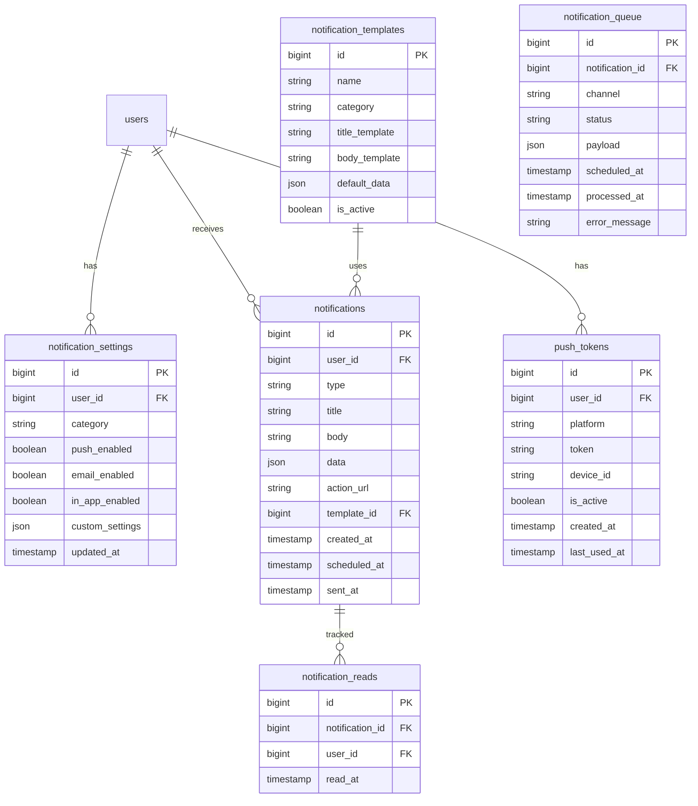

# SnatchTradingChatApp 通知システム仕様書

## 1. 概要
本ドキュメントは、SnatchTradingChatAppの通知システム（プッシュ通知、アプリ内通知、メール通知）に関する詳細仕様を定義します。

## 2. UI/UXデザイン

### 2.1 通知センター画面
- **デザイン**: ドロップダウン形式
- **要素**:
  - 未読通知数バッジ
  - 通知リスト
  - 既読/未読状態
  - 通知時刻
  - すべて既読にするボタン

### 2.2 通知設定画面
- **デザイン**: トグルスイッチ形式
- **要素**:
  - 通知カテゴリー別ON/OFF
  - 通知方法選択（プッシュ/メール/アプリ内）
  - 通知時間帯設定
  - 通知音設定

### 2.3 プッシュ通知
- **デザイン**: OS標準の通知UI
- **要素**:
  - アプリアイコン
  - 通知タイトル
  - 通知本文
  - アクションボタン（返信、既読等）

### 2.4 アプリ内通知
- **デザイン**: トースト/バナー形式
- **要素**:
  - 通知アイコン
  - 通知メッセージ
  - アクションボタン
  - 自動消去タイマー

## 3. 画面遷移フロー

```
1. アプリ起動
   ├─ 通知許可リクエスト（初回のみ）
   └─ メイン画面
       ├─ 通知アイコン
       │   └─ 通知センター
       │       └─ 個別通知
       │           └─ 関連コンテンツへ遷移
       └─ 設定
           └─ 通知設定
               ├─ カテゴリー別設定
               └─ 詳細設定
```

## 4. ER図



## 5. エンドポイント

### 5.1 通知取得関連

#### GET /api/notifications
- **説明**: 通知一覧取得
- **ヘッダー**: Authorization: Bearer {token}
- **パラメータ**:
  - `page`: number
  - `limit`: number
  - `unread_only`: boolean
  - `category`: string
- **レスポンス**:
```json
{
  "notifications": [{
    "id": 1,
    "type": "message",
    "title": "新しいメッセージ",
    "body": "山田さんからメッセージが届きました",
    "data": {
      "channel_id": "123",
      "message_id": "456"
    },
    "action_url": "/channels/123/messages/456",
    "is_read": false,
    "created_at": "2024-01-01T10:00:00Z"
  }],
  "unread_count": 5,
  "has_more": true
}
```

#### GET /api/notifications/unread-count
- **説明**: 未読通知数取得
- **ヘッダー**: Authorization: Bearer {token}
- **レスポンス**:
```json
{
  "total": 5,
  "by_category": {
    "message": 3,
    "mention": 1,
    "article": 1
  }
}
```

### 5.2 通知操作関連

#### PUT /api/notifications/{notificationId}/read
- **説明**: 通知を既読にする
- **ヘッダー**: Authorization: Bearer {token}

#### PUT /api/notifications/read-all
- **説明**: すべての通知を既読にする
- **ヘッダー**: Authorization: Bearer {token}
- **リクエスト**:
```json
{
  "category": "message" // optional
}
```

#### DELETE /api/notifications/{notificationId}
- **説明**: 通知を削除
- **ヘッダー**: Authorization: Bearer {token}

### 5.3 通知設定関連

#### GET /api/notification-settings
- **説明**: 通知設定取得
- **ヘッダー**: Authorization: Bearer {token}
- **レスポンス**:
```json
{
  "settings": [{
    "category": "message",
    "label": "メッセージ通知",
    "push_enabled": true,
    "email_enabled": false,
    "in_app_enabled": true,
    "sub_settings": {
      "dm_only": false,
      "mentions_only": false
    }
  }],
  "quiet_hours": {
    "enabled": true,
    "start": "22:00",
    "end": "08:00",
    "timezone": "Asia/Tokyo"
  }
}
```

#### PUT /api/notification-settings
- **説明**: 通知設定更新
- **ヘッダー**: Authorization: Bearer {token}
- **リクエスト**:
```json
{
  "category": "message",
  "push_enabled": true,
  "email_enabled": false,
  "in_app_enabled": true,
  "sub_settings": {
    "dm_only": true
  }
}
```

### 5.4 プッシュトークン関連

#### POST /api/push-tokens
- **説明**: プッシュトークン登録
- **ヘッダー**: Authorization: Bearer {token}
- **リクエスト**:
```json
{
  "token": "fcm_token_here",
  "platform": "ios", // "ios", "android", "web"
  "device_id": "device_unique_id"
}
```

#### DELETE /api/push-tokens/{tokenId}
- **説明**: プッシュトークン削除
- **ヘッダー**: Authorization: Bearer {token}

### 5.5 WebSocket通知

#### WS /ws/notifications
- **説明**: リアルタイム通知配信
- **認証**: URLパラメータでトークン送信
- **イベント**:
  - `notification:new`: 新規通知
  - `notification:update`: 通知更新
  - `notification:delete`: 通知削除

### 5.6 通知送信（内部API）

#### POST /api/internal/notifications/send
- **説明**: 通知送信（サーバー間通信用）
- **ヘッダー**: X-Internal-Token: {internal_token}
- **リクエスト**:
```json
{
  "user_ids": [1, 2, 3],
  "template": "new_message",
  "data": {
    "sender_name": "山田太郎",
    "channel_name": "一般",
    "message_preview": "こんにちは..."
  },
  "channels": ["push", "in_app"],
  "schedule_at": null
}
```

## 6. 機能構成（階層構造）

```
通知システム
├── 通知種別
│   ├── メッセージ通知
│   │   ├── 新規メッセージ
│   │   ├── メンション
│   │   └── DM
│   ├── チャンネル通知
│   │   ├── 招待
│   │   ├── 参加/退出
│   │   └── 設定変更
│   ├── 記事通知
│   │   ├── 新規投稿
│   │   ├── コメント
│   │   └── いいね
│   ├── システム通知
│   │   ├── メンテナンス
│   │   ├── アップデート
│   │   └── セキュリティ
│   └── 決済通知
│       ├── 支払い成功/失敗
│       ├── プラン変更
│       └── 更新リマインダー
│
├── 配信チャネル
│   ├── プッシュ通知
│   │   ├── iOS (APNs)
│   │   ├── Android (FCM)
│   │   └── Web Push
│   ├── アプリ内通知
│   │   ├── 通知センター
│   │   ├── バッジ
│   │   └── トースト
│   ├── メール通知
│   │   ├── 即時配信
│   │   └── ダイジェスト
│   └── WebSocket
│       └── リアルタイム配信
│
├── 通知管理
│   ├── テンプレート管理
│   ├── 多言語対応
│   ├── パーソナライゼーション
│   └── A/Bテスト
│
├── ユーザー設定
│   ├── カテゴリー別ON/OFF
│   ├── チャネル別設定
│   ├── 時間帯設定
│   └── 頻度制限
│
└── 分析・最適化
    ├── 開封率測定
    ├── クリック率測定
    ├── 配信失敗分析
    └── エンゲージメント分析
```

## 7. データ管理方針

### 7.1 通知データ
- 通知履歴: PostgreSQLで30日間保存
- 未読状態: Redisで高速管理
- テンプレート: PostgreSQLで管理

### 7.2 配信管理
- キュー管理: Redis + Bull Queue
- 配信ステータス: PostgreSQLで記録
- リトライ: 最大3回、指数バックオフ

### 7.3 プッシュトークン
- トークン管理: PostgreSQLで永続化
- 無効トークン: 自動クリーンアップ
- デバイス管理: 1ユーザー最大5デバイス

## 8. 実装上の注意点

### 8.1 配信最適化
- バッチ配信による効率化
- 優先度に基づく配信順序
- レート制限の実装
- 重複通知の防止

### 8.2 プラットフォーム対応
- iOS: APNs HTTP/2 API
- Android: FCM v1 API
- Web: Service Worker + Web Push API
- 各プラットフォームの制限事項対応

### 8.3 実装技術
- **プッシュ通知**: Firebase Cloud Messaging
- **メール配信**: SendGrid or AWS SES
- **キュー管理**: Bull Queue
- **テンプレートエンジン**: Handlebars
- **多言語対応**: i18next
- **WebSocket**: Socket.io

## 9. エラーハンドリング

### 9.1 配信エラー
- トークン無効: 自動削除
- ネットワークエラー: リトライ
- レート制限: バックオフ

### 9.2 設定エラー
- 権限不足: 適切なフォールバック
- 設定競合: 最新の設定を優先

### 9.3 システムエラー
- キュー満杯: 一時的な配信停止
- DB接続エラー: キャッシュから配信

## 10. 今後の拡張性

### 10.1 高度な配信制御
- AI による最適配信時間予測
- ユーザー行動に基づく自動最適化
- 地理的位置に基づく配信

### 10.2 新しい通知チャネル
- SMS通知
- Slack/Discord連携
- LINE通知

### 10.3 分析機能強化
- 詳細なファネル分析
- コホート分析
- 予測分析
