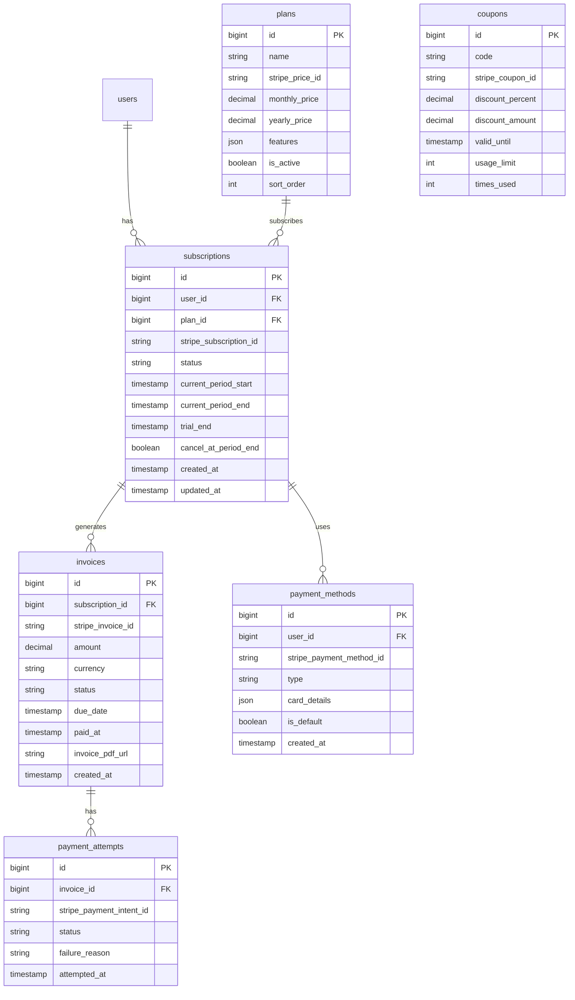

# SnatchTradingChatApp 決済・サブスクリプション機能仕様書

## 1. 概要
本ドキュメントは、SnatchTradingChatAppの決済・サブスクリプション機能（Stripe連携、プラン管理、請求処理）に関する詳細仕様を定義します。

## 2. UI/UXデザイン

### 2.1 プラン選択画面
- **デザイン**: カード形式の料金プラン表示
- **要素**:
  - プラン名
  - 月額/年額料金
  - 機能比較表
  - 選択ボタン

### 2.2 支払い情報入力画面
- **デザイン**: Stripe Elementsを使用したセキュアなフォーム
- **要素**:
  - カード番号入力
  - 有効期限
  - セキュリティコード
  - 請求先住所（オプション）

### 2.3 サブスクリプション管理画面
- **デザイン**: ダッシュボード形式
- **要素**:
  - 現在のプラン情報
  - 次回請求日
  - プラン変更ボタン
  - 支払い方法変更
  - キャンセルボタン

### 2.4 請求履歴画面
- **デザイン**: テーブル形式
- **要素**:
  - 請求日
  - 金額
  - ステータス
  - 請求書ダウンロード
  - 領収書ダウンロード

## 3. 画面遷移フロー

```
1. アカウント設定
   └─ サブスクリプション
       ├─ プラン選択
       │   └─ 支払い情報入力
       │       └─ 確認画面
       │           └─ 完了画面
       ├─ プラン変更
       │   └─ 変更確認
       ├─ 支払い方法変更
       └─ 請求履歴
           └─ 請求書詳細
```

## 4. ER図



## 5. エンドポイント

### 5.1 プラン関連

#### GET /api/plans
- **説明**: 利用可能なプラン一覧取得
- **レスポンス**:
```json
{
  "plans": [{
    "id": 1,
    "name": "ベーシックプラン",
    "monthly_price": 980,
    "yearly_price": 9800,
    "features": [
      "基本チャット機能",
      "最大3チャンネル",
      "メッセージ履歴30日"
    ],
    "is_recommended": false
  }, {
    "id": 2,
    "name": "プロフェッショナルプラン",
    "monthly_price": 2980,
    "yearly_price": 29800,
    "features": [
      "全機能利用可能",
      "無制限チャンネル",
      "メッセージ履歴無制限",
      "優先サポート"
    ],
    "is_recommended": true
  }]
}
```

### 5.2 サブスクリプション管理

#### GET /api/subscription
- **説明**: 現在のサブスクリプション情報取得
- **ヘッダー**: Authorization: Bearer {token}
- **レスポンス**:
```json
{
  "subscription": {
    "id": 1,
    "plan": {
      "id": 2,
      "name": "プロフェッショナルプラン"
    },
    "status": "active",
    "current_period_start": "2024-01-01T00:00:00Z",
    "current_period_end": "2024-02-01T00:00:00Z",
    "cancel_at_period_end": false,
    "payment_method": {
      "type": "card",
      "last4": "4242",
      "brand": "Visa"
    }
  }
}
```

#### POST /api/subscription
- **説明**: サブスクリプション作成
- **ヘッダー**: Authorization: Bearer {token}
- **リクエスト**:
```json
{
  "plan_id": 2,
  "payment_method_id": "pm_1234567890",
  "coupon_code": "WELCOME20"
}
```

#### PUT /api/subscription
- **説明**: サブスクリプション更新（プラン変更）
- **ヘッダー**: Authorization: Bearer {token}
- **リクエスト**:
```json
{
  "plan_id": 3,
  "proration_behavior": "create_prorations"
}
```

#### DELETE /api/subscription
- **説明**: サブスクリプションキャンセル
- **ヘッダー**: Authorization: Bearer {token}
- **リクエスト**:
```json
{
  "cancel_immediately": false,
  "reason": "コスト削減のため"
}
```

### 5.3 支払い方法関連

#### GET /api/payment-methods
- **説明**: 登録済み支払い方法一覧
- **ヘッダー**: Authorization: Bearer {token}

#### POST /api/payment-methods
- **説明**: 支払い方法追加
- **ヘッダー**: Authorization: Bearer {token}
- **リクエスト**:
```json
{
  "payment_method_id": "pm_1234567890",
  "make_default": true
}
```

#### PUT /api/payment-methods/{paymentMethodId}/default
- **説明**: デフォルト支払い方法変更
- **ヘッダー**: Authorization: Bearer {token}

#### DELETE /api/payment-methods/{paymentMethodId}
- **説明**: 支払い方法削除
- **ヘッダー**: Authorization: Bearer {token}

### 5.4 請求関連

#### GET /api/invoices
- **説明**: 請求履歴取得
- **ヘッダー**: Authorization: Bearer {token}
- **パラメータ**:
  - `page`: number
  - `limit`: number
  - `status`: string (paid, pending, failed)

#### GET /api/invoices/{invoiceId}
- **説明**: 請求書詳細取得
- **ヘッダー**: Authorization: Bearer {token}

#### GET /api/invoices/{invoiceId}/download
- **説明**: 請求書PDFダウンロード
- **ヘッダー**: Authorization: Bearer {token}

### 5.5 Stripe Webhook

#### POST /api/stripe/webhook
- **説明**: Stripeイベント受信
- **ヘッダー**: stripe-signature
- **イベントタイプ**:
  - `customer.subscription.created`
  - `customer.subscription.updated`
  - `customer.subscription.deleted`
  - `invoice.payment_succeeded`
  - `invoice.payment_failed`
  - `payment_method.attached`

## 6. 機能構成（階層構造）

```
決済・サブスクリプション機能
├── プラン管理
│   ├── プラン一覧表示
│   ├── プラン詳細表示
│   ├── 機能比較
│   └── おすすめプラン表示
│
├── サブスクリプション管理
│   ├── 新規登録
│   │   ├── プラン選択
│   │   ├── 支払い情報入力
│   │   └── 確認・完了
│   ├── プラン変更
│   │   ├── アップグレード
│   │   ├── ダウングレード
│   │   └── 日割り計算
│   ├── 一時停止
│   └── 解約
│       ├── 即時解約
│       └── 期間終了時解約
│
├── 支払い方法管理
│   ├── カード登録
│   ├── カード変更
│   ├── カード削除
│   └── デフォルト設定
│
├── 請求管理
│   ├── 請求履歴
│   ├── 請求書発行
│   ├── 領収書発行
│   └── 支払い再試行
│
├── クーポン・割引
│   ├── クーポン適用
│   ├── 期間限定割引
│   └── ボリューム割引
│
└── 決済処理
    ├── 支払い処理
    ├── 3Dセキュア認証
    ├── 失敗時リトライ
    └── 返金処理
```

## 7. データ管理方針

### 7.1 決済情報
- カード情報: Stripeで管理（PCI DSS準拠）
- 決済トークン: 暗号化してPostgreSQLに保存
- 請求データ: PostgreSQLとStripeで二重管理

### 7.2 サブスクリプション状態
- 状態管理: Stripeをマスターとして同期
- キャッシュ: Redisで頻繁アクセスデータを管理
- 更新通知: Webhookで即時反映

### 7.3 セキュリティ
- API通信: すべてHTTPS
- Webhook検証: 署名による改ざん防止
- トークン管理: 環境変数で管理

## 8. 実装上の注意点

### 8.1 Stripe統合
- API Version固定
- Idempotency Keyの実装
- エラーハンドリング
- Rate Limit対策

### 8.2 決済フロー
- 3Dセキュア対応
- SCA（強力な顧客認証）対応
- 決済失敗時の適切なエラーメッセージ
- 二重課金防止

### 8.3 実装技術
- **決済プラットフォーム**: Stripe
- **Stripe SDK**: @stripe/stripe-js, stripe-node
- **Webhook処理**: Express + body-parser（raw body）
- **セキュリティ**: helmet, cors
- **バリデーション**: joi or yup

## 9. エラーハンドリング

### 9.1 決済エラー
- カード拒否: 適切なエラーメッセージ表示
- 残高不足: 支払い方法変更を促す
- 有効期限切れ: カード更新を促す

### 9.2 サブスクリプションエラー
- 支払い失敗: 猶予期間の設定（3日間）
- 自動リトライ: Stripe Smart Retries
- サービス停止: 段階的な機能制限

### 9.3 システムエラー
- Stripe API障害: エラーページ表示
- Webhook失敗: 手動同期機能
- タイムアウト: リトライ処理

## 10. 今後の拡張性

### 10.1 決済手段の拡充
- Apple Pay / Google Pay対応
- 銀行振込対応
- 仮想通貨決済

### 10.2 高度な料金体系
- 従量課金制
- カスタムプライシング
- パートナー割引

### 10.3 分析・レポート
- MRR（月間経常収益）ダッシュボード
- チャーン率分析
- LTV（顧客生涯価値）計算
