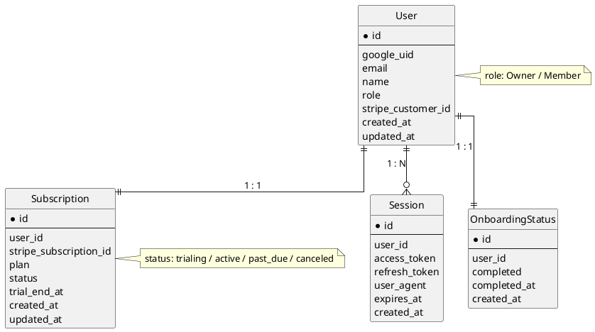

# SnatchTradingChatApp ログイン画面機能仕様書

## 1. 概要
- 会員制投資コミュニティ「すなっちゃん」へアクセスする入口となる認証画面。
- Firebase Auth（Googleプロバイダ）を利用したOAuthログインを採用し、未認証ユーザーに料金情報（¥4,800/月）と14日間トライアルを提示。
- 成功時は投資ダッシュボードへ遷移し、初回ログイン時はオンボーディングモーダルを表示。

## 2. UI/UXデザイン
- シングルカラム構成（モバイル優先）、デスクトップではヒーローセクション＋補助情報の2カラム展開。
- ブランドパレット：メイン #FF6B35、アクセント #1B1F3B、ニュートラルグレー。角丸4px・多層ドロップシャドウを共通適用。
- フォント：Google Sans（英数）、Noto Sans JP（日本語）。CTAはフィルボタン＋十分な余白で視認性確保。
- コンテンツ要素：ヒーローコピー、料金＆トライアル説明カード、CTAボタン2種（Googleログイン／無料トライアル開始）、FAQリンク。
- レスポンシブ方針：600px未満は縦積み、600-1024pxは中央寄せ、1024px以上は左右レイアウト。背景に軽いグラデーションやブランドイラストを使用。

## 3. 画面遷移フロー
1. 未認証ユーザーが `/login` にアクセス。
2. 既存セッショントークン有効 → 自動で投資ダッシュボードへリダイレクト。
3. 「Googleでログイン」クリック → OAuth認可画面（Google）。
4. 認可成功 → コールバックでセッション生成 → 投資ダッシュボードへ遷移。
5. 初回ログイン時 → オンボーディングモーダル表示 → 完了後ダッシュボード利用開始。
6. ログアウト後は再度 `/login` へ遷移。

## 4. ER図

- Roleは `Owner` / `Member`。
- Subscription.statusは `trialing` / `active` / `past_due` / `canceled` を想定。
- SessionテーブルはToken管理用（要採用スタックに合わせて調整）。

## 5. エンドポイント
- GET `/login`：SSRで画面描画。セッション有効時は302で `/dashboard` へ。
- POST `/api/auth/firebase/login`：Firebase AuthのIDトークン受領→検証→セッションクッキー発行。
- POST `/api/auth/firebase/logout`：Firebaseセッションクッキー失効、Refreshトークン失効。
- GET `/api/auth/firebase/session`：セッション検証用エンドポイント（フロント初期化時に利用）。
- Stripe Customer PortalやWebhook連携は本機能と同時構築予定。

## 6. 機能構成（階層構造）
- `pages/login`（または`app/login/page`）：ページコンテナ。SSRでセッション判定、UIレンダリング。
  - `components/LoginHero`：ヒーローコピー・補足説明。
  - `components/PricingCard`：料金・トライアル情報の表示。
  - `components/GoogleSignInButton`：OAuth開始処理、ローディング状態表示。
  - `components/TrialCtaButton`：トライアル詳細モーダルやFAQへの導線。
- `modules/auth`：Firebase Authとサーバーセッションの橋渡し、ユーザー同期。
- `modules/onboarding`：初回フラグ判定とモーダル表示制御。

## 7. データ管理方針
- Firebase Authのクレデンシャル（APIキー、Service Account）は環境変数で管理。フロント側は公開APIキーのみ参照。
- セッションはFirebaseセッションクッキー＋短期アクセストークンと長期リフレッシュトークンの二段構成。
- Stripeサブスクリプション情報はWebhook連携を本機能と同時構築し、User/Subscriptionを更新。ログイン時に最新状態を参照。
- トライアル終了日時やプラン情報はCMSまたは設定テーブルで集中管理し、画面表示と整合性を確保。
- オンボーディング完了フラグはUserメタデータに保存し、サーバー判定を優先。

## 8. 実装上の注意点
- OAuthリクエストに`state`と`nonce`を付与しCSRF・リプレイ攻撃を防ぐ（Firebase Authの`auth_nonce`利用）。
- SSRでセッション判定することでFlicker（認証済→再リダイレクト）を防止。
- トライアル表示値はキャッシュ使用時でも有効期限を設定し、変更時に即時反映できるようにする。
- Stripe Customer Portalへのリンクはログイン後メニューに限定。未課金ユーザーは利用できないUIとする。
- 初回オンボーディングはフロントのローカルストレージとサーバーフラグを併用し、誤再表示を抑制。
- オンボーディングモーダルの内容は現時点で固定要件なし。将来的な文言差し替えに備え、設定値またはCMSから取得できる設計とする。

## 9. エラーハンドリング
- OAuth失敗：トースト表示（例「Googleログインに失敗しました」）＋再試行ボタン。ログに詳細エラーIDを残す。
- 招待制外アカウント：メッセージ「コミュニティ管理者までお問い合わせください」を表示しダッシュボード遷移を阻止。
- サブスクリプション失効：ダッシュボード遷移前に課金再開案内ダイアログを表示。Portalへ遷移するCTAを用意。
- ネットワーク障害：指数バックオフで再試行。一定回数失敗でサポート窓口を案内。

## 10. 今後の拡張性
- 追加認証手段の導入（Email/Password、Apple Sign In、Slack SSOなど）。
- オンボーディングにアンケートやチュートリアルを組み込み、ユーザープロファイル収集を強化。
- ログイン画面に最新アップデート、動画紹介、ユーザーボイスなどマーケティング要素を追加。
- ABテストでCTA文言・料金表示レイアウトを最適化しコンバージョン向上。

---
## 要確認事項
- 現時点なし（要件回答済）。
