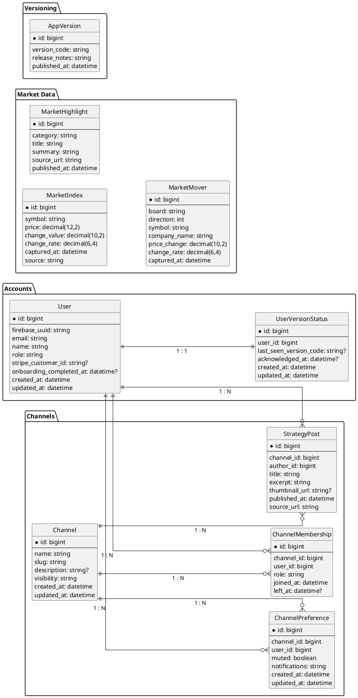

# メイン画面機能仕様書

## 1. 概要
- 会員制投資コミュニティのホーム画面として、投資指標のサマリー、最新ニュース、マーケット動向、運営からのお知らせを集約する中核ビュー。
- 左サイドバーのナビゲーションから各機能（ホーム／すなっちゃんの投資戦略／限定記事／機能一覧／DM／ブックマーク／設定）へ移動しやすい情報設計。
- ログイン済みユーザー向けに挨拶・検索ボックス・リアルタイム更新（60秒〜5分間隔のウィジェット更新）を提供し、初回またはバージョンアップ時はガイダンスモーダルを表示する。

## 2. UI/UXデザイン
- レイアウトは3カラム構成：左に固定サイドバー、中央に主要ウィジェット群（Overview / Highlight / Market Mover）、右に「すなっちゃんの最新投稿」フィードを表示。
- ブランドパレット、タイポグラフィ、角丸4px、多層シャドウなどのデザインシステムはログイン画面と共通。背景には淡いグラデーションを使用し、カード境界は2pxラインで視認性を確保。
- サイドバーはアイコン＋テキストを縦並びにし、選択中メニューをハイライト。
    - メニュー項目の定義方式について
        - 設定ファイル（例：YAML/JSON）から読み込む構造とし、将来的な項目追加を容易にする案: 仕様を共通化できるなら採用
        - コンポーネント毎にクリーンに設計する案: 共通化が難しい場合はこちらを採用し、必要に応じて再構成
- Overviewカード
    - カード内に指標名、取引値、前日比、変化率を数値＋トレンドアイコンで表示。更新時にはミニマルなフェード切替を適用。
    - カード種類の切り替え方法
        - 横スクロール
        - クリック
        - 1st版未対応: 3カード固定表示
- Highlight
    - カテゴリー別テキストリスト
- Market Mover
    - タブ（S&P / NASDAQ / DOW）切替＋上昇/下落の2カラムテーブル
- すなっちゃんの最新投稿フィード
    - カードリスト形式で投稿者サムネイル・投稿者名・チャンネル名・内容・経過時間を表示
    - ユーザーが参加しているチャンネルで、かつミュートしていないチャンネルの投稿のみを表示
- データ更新間隔
    - 初期ロード後にsetInterval（可視時のみ）で再取得、タブ切替時は即時更新
    - Overview: 60s
    - Highlight: 180~300s
    - Market Mover: 180~300s
    - 最新投稿: 60s
## 3. 画面遷移フロー
- ウィジェット更新サイクル
    1. 初期ロードでOverview / Highlight / Market Mover / 最新投稿を並列取得
    2. 各ウィジェットのインターバルに従い自動再取得（画面非表示時は停止）
- 検索アクション
    1. ユーザーが検索バーに入力→Enter
    2. 結果は検索結果画面またはモーダルへ遷移（別仕様書で定義）
- サイドバー遷移
    1. メニュークリック
    2. 対応画面へ遷移／モーダルを起動

## 4. ER図

- AppVersion: 最新バージョンとリリースノートを管理
- UserVersionStatus: ユーザーが最後に確認したバージョンを保持し、バージョンモーダルの再表示制御に利用
- MarketIndex / MarketHighlight / MarketMover / StrategyPost: 各ウィジェットの表示データを供給
- MarketMover
    - symbol: 指数を表すコード（例: sp500, nasdaq, dow）
    - board: 対象市場の区分（例: S&P, NASDAQ, DOW）
    - direction: 騰落方向（gainers: 上昇、losers: 下落）
        - enum: gainers=1, losers=0
    - price_change: 前日比の価格変動額（通貨単位）
    - change_rate: 前日比の変動率（例: 0.0215 は +2.15%）
- MarketIndex
    - symbol: 指数を表すコード（例: sp500, nasdaq, dow）
    - price: 取得時点の指数値（終値またはリアルタイム値）
    - change_value: 前回終値からの変化額（指数ポイント単位）
    - change_rate: 変化率（例: 0.0125 は +1.25%）
- Channels
    - slug: URL やAPIで使う一意な識別子。
    - description: チャンネルの概要テキスト（任意）。
    - visibility: 公開範囲。public なら全ユーザー閲覧可能、private なら参加メンバーのみ。
- ChannelMembership: ユーザーがどのチャンネルに参加しているかを管理する中間テーブル
    - channel_id: 対象チャンネルのID（Channels との外部キー）。
    - role: チャンネル内権限。admin（管理者）または member。
    - joined_at: 参加日時。
    - left_at: 退会日時（現在は null、退会後に値が入る想定）。
- ChannelPreference: ユーザーごとのチャンネル設定
    - channel_id: 対象チャンネルのID。
    - user_id: 設定を持つユーザーのID。
    - muted: ミュート状態フラグ。
    - notifications: 通知レベル。例：default（通常）、mentions_only、off。

## 5. エンドポイント (TBD)

- GET /api/dashboard/overview：主要指数（S&P500、NASDAQなど）の最新スナップショットを配列で返却。クエリでlimit、indices[]指定可能。
- GET /api/dashboard/highlights：カテゴリー別ハイライト記事を返却。category、limit、since（ISO8601）をサポート。
- GET /api/dashboard/market-movers：タブ表示用の上昇・下落銘柄を返却。クエリにboard（sp500/nasdaq/dow）、direction（gainers/losers）、limit。
- GET /api/dashboard/strategy-posts：ユーザーが参加中かつミュートしていないチャンネルの投稿を返却。limit、cursorでページング。user_idを基にサーバー側でフィルタリング・既読状態付与。
- GET /api/dashboard/version：最新バージョンコードと掲示すべきリリースノートを返却。
- POST /api/dashboard/version/ack：ユーザーがバージョンモーダルを確認した際に last_seen_version_code を更新。
- ※将来的にGraphQL/BFFへ統合する場合はエンドポイント構成を再検討。

## 6. 機能構成（階層構造）(TBD)

- app/(dashboard)/page/：メインページコンテナ。初期データ取得、リアルタイム更新スケジューリング、レイアウト制御。
    - layout/
        - Sidebar：メニュー定義をロードしアイコン＋テキストを描画。設定ファイル／API切替に対応。
    - widgets/
        - OverviewCarousel：主要指数カードを横スクロール表示。
        - OverviewCards：指数名・価格・前日比・トレンドアイコンを表示。
        - Highlights：カテゴリ別見出しとテキストリストを表示。
        - MarketMovers：TabGroupとMarketMoverTableを内包しタブ切替時に再取得。
        - StrategyPosts：ユーザー参加チャンネルの投稿をフィルタリングして表示。
    - components/
        - SearchBar：ユーザー＆コンテンツ検索の入力フィールド。将来的にサジェストを追加。
        - VersionModal：バージョン差分通知用モーダル。更新ボタン押下でリロード or アプリ内アップデート処理。

## 7. データ管理方針 (TBD)

- 初期表示データはサーバーサイドレンダリングで取得し、キャッシュ可能なもの（マーケット指数、ハイライト）は短期キャッシュ（60〜180秒）を適用。
- クライアント側ではReact Query/SWR等でウィジェットごとに再検証間隔を設定（Overview=60s、Highlight/Market Mover=180s、StrategyFeed=60s）。
- APIレスポンスにはcaptured_atやpublished_atを含め、クライアントで相対時刻表示（◯分前）を計算。
- 市場データの取得元（例：Polygon、Alpha Vantage）をsourceフィールドに記録し、監査や障害切り替えに備える。
- サイドバーメニューはconfig/navigation.yml等の設定ファイルで管理し、差分デプロイまたはCMSによる更新を想定。
- バージョン情報はAppVersionを基本とし、CDNキャッシュを活用して応答を高速化。
- StrategyPost取得時はサーバー側でChannelMembership＋ChannelPreference.mutedを参照し、利用者ごとの表示制御を行う。

## 8. 実装上の注意点 (TBD)

- ウィジェット更新時はスケルトン表示または前回値保持でレイアウトジャンプを防止。
- 失敗したウィジェットのみ再試行可能なUI（カード内のリトライボタン＋エラーステータス）を提供。
- 横スクロール（Overview）はキーボード操作・スクリーンリーダー対応を行い、aria-liveなどを適切に設定。
- バージョンモーダルは更新必須の際に閉じられない仕様（mandatory相当の判定はAPI側で制御）。確認後にUserVersionStatusを更新。
- サイドバー設定ファイルが変更された場合のホットリロード方式を検討（Next.js再ビルド／CMS経由キャッシュクリア等）。
- 国際化対応を想定し、テキストはi18n辞書から取得。通貨・日付フォーマットはユーザーLocaleで切り替える。
- StrategyPostはクエリごとにユーザーIDを必須とし、未参加・ミュートチャンネルを除外するSQL/JOIN最適化に留意。

## 9. エラーハンドリング (TBD)

- GET /api/dashboard/* が失敗した場合、各カード内にエラーメッセージと再試行ボタンを表示。一定回数失敗でサポート窓口リンクを提示。
    - 不要かもしれない
- ネットワーク断検知時はページ上部にトースト通知を出し、接続復帰後に自動リフレッシュ。
- バージョンAPIが取得できない場合は最新チェックを一時スキップし、ログ送信のうえ次回アクセスで再試行。
- 空データの場合は「現在取得できるデータがありません」などのプレースホルダーと直近取得時刻を表示。
- StrategyPost取得で権限不足（未参加チャンネルなど）の場合はHTTP 403を返却し、クライアントは非表示処理とアラートを実施。
- 検索バー送信時のエラーはモーダル表示し、入力内容を保持したまま再試行可能にする。

## 10. 今後の拡張性

- ウィジェットの追加（経済指標カレンダー、ポートフォリオ分析など）やレイアウトカスタマイズ機能。
- ノーティフィケーションセンターやアラート設定との連携強化。
- サイドバー項目の動的管理（設定ファイル／CMS連携）、A/Bテストによるウィジェット順序最適化。
- StrategyPostへのコメント・リアクション導線追加、推奨チャンネルのサジェスト機能。

---
## 要確認事項
- バージョンオンボーディングモーダルの文言・詳細動線（例：更新ボタン押下での挙動）
