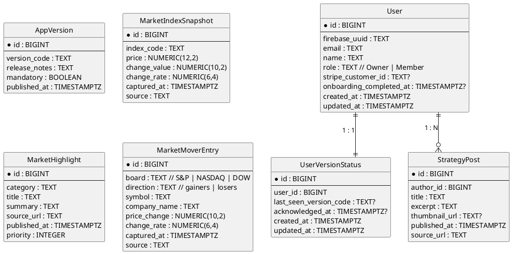

# SnatchTradingChatApp メイン画面機能仕様書

<!-- TODO: 最新モックの画像URLを設定 -->

## 1. 概要
- 会員制投資コミュニティのホーム画面として、投資指標のサマリー、最新ニュース、マーケット動向、運営からのお知らせを集約する中核ビュー。
- 左サイドバーのナビゲーションから各機能（ホーム／すなっちゃんの投資戦略／限定記事／機能一覧／DM／ブックマーク／設定）へ移動しやすい情報設計。
- ログイン済みユーザー向けに挨拶・検索ボックス・リアルタイム更新（60秒〜5分間隔のウィジェット更新）を提供し、初回またはバージョンアップ時はガイダンスモーダルを表示する。

## 2. UI/UXデザイン
- レイアウトは3カラム構成：左に固定サイドバー、中央に主要ウィジェット群（Overview / Highlight / Market Mover）、右に「すなっちゃんの最新投稿」フィードを表示。
- ブランドパレット、タイポグラフィ、角丸4px、多層シャドウなどのデザインシステムはログイン画面と共通。背景には淡いグラデーションを使用し、カード境界は2pxラインで視認性を確保。
- サイドバーはアイコン＋テキストを縦並びにし、選択中メニューをハイライト。メニュー定義は設定ファイル（例：YAML/JSON）から読み込む構造とし、将来的な項目追加を容易にする。
- Overviewカードは横スクロール対応。カード内に指標名、取引値、前日比、変化率を数値＋トレンドアイコンで表示。更新時にはミニマルなフェード切替を適用。
- Highlightはカテゴリー別テキストリスト、Market Moverはタブ（S&P / NASDAQ / DOW）切替＋上昇/下落の2カラムテーブル。右フィードはカードリスト形式で投稿サムネイル・要約・経過時間を表示。
- データ更新間隔：Overview=60秒、Highlight=180秒、Market Mover=180秒、最新投稿=60秒。初期ロード後にsetInterval（可視時のみ）で再取得、タブ切替時は即時更新。

## 3. 画面遷移フロー
- セッション＆バージョン確認
    - 既存セッショントークンが有効？
        - はい
            - 最新バージョンとの差分あり？（`AppVersion.latest_version_code` ≠ クライアント保持バージョン）
                1. バージョンオンボーディングモーダルを表示
                2. ユーザーが「閉じる」または「更新」アクション → `UserVersionStatus` を更新
            1. メイン画面を表示（ウィジェット初期ロード開始）
        - いいえ
            1. `/login` へリダイレクト
- ウィジェット更新サイクル
    1. 初期ロードでOverview / Highlight / Market Mover / 最新投稿を並列取得
    2. 各ウィジェットのインターバルに従い自動再取得（画面非表示時は停止）
- 検索アクション
    1. ユーザーが検索バーに入力→Enter
    2. 結果は検索結果画面またはモーダルへ遷移（別仕様書で定義）
- サイドバー遷移
    1. メニュークリック
    2. 対応画面へ遷移／モーダルを起動（DMなど）
- ログアウト
    1. 右上ユーザーアイコン→ログアウト選択
    2. セッション無効化→`/login` へ遷移

## 4. ER図

- AppVersionは最新バージョンやリリースノートを管理。
- UserVersionStatusはユーザーが最後に確認したバージョンを保持し、バージョンモーダルの再表示制御に利用。
- MarketIndexSnapshot / MarketHighlight / MarketMoverEntry / StrategyPostはそれぞれWidgetの表示データを供給。

## 5. エンドポイント (TBD)
- GET `/api/dashboard/overview`：主要指数（S&P500、NASDAQなど）の最新スナップショットを配列で返却。クエリで`limit`、`indices[]`指定可能。
- GET `/api/dashboard/highlights`：カテゴリー別ハイライト記事を返却。`category`、`limit`、`since`（ISO8601）をサポート。
- GET `/api/dashboard/market-movers`：タブ表示用の上昇・下落銘柄を返却。クエリに`board`（sp500/nasdaq/dow）、`direction`（gainers/losers）、`limit`。
- GET `/api/dashboard/strategy-posts`：運営投稿リストを返却。`limit`、`cursor`でページング。既読状態を付与する場合は`user_id`をもとにサーバー側で付加。
- GET `/api/dashboard/version`：最新バージョンコードと掲示すべきリリースノート、更新必須フラグを返却。
- POST `/api/dashboard/version/ack`：ユーザーがバージョンモーダルを確認した際に `last_seen_version_code` を更新。
- ※後日、GraphQLまたはBFFに統合する場合はエンドポイント構成を再検討する。

## 6. 機能構成（階層構造）(TBD)
- `app/(dashboard)/page`：メインページコンテナ。初期データ取得、リアルタイム更新のスケジューリング、レイアウト制御。
  - `layout/Sidebar`：メニュー定義を取得し、アイコン＋テキストのリストを描画。設定ファイル（YAML/JSON）経由でメニューを差し替え可能。
  - `widgets/OverviewCarousel`：主要指数カードを横スクロール描画。内部で`OverviewCard`を生成。
    - `widgets/OverviewCard`：指標名、価格、前日比、トレンドアイコンを表示。
  - `widgets/HighlightList`：カテゴリ別見出しとテキストリストを表示。スクロール内でフェードイン演出。
  - `widgets/MarketMoverTabs`：`TabGroup`と`MarketMoverTable`を内包。タブ切替時にAPIリクエスト実行。
  - `widgets/StrategyFeed`：右カラムのカードリスト。`StrategyCard`コンポーネントを複数並べる。
  - `components/SearchBar`：ユーザー検索、コンテンツ検索の入力フィールド。サジェスト機能（将来対応）。
  - `components/VersionModal`：バージョン差分通知用モーダル。更新ボタン押下でリロードまたはアプリ内アップデート処理。

## 7. データ管理方針 (TBD)
- 初期表示データはサーバーサイドフェッチ（SSR）で取得し、キャッシュ可能なもの（マーケット指数、ハイライト）には短期キャッシュ（60〜180秒）を適用。
- クライアント側ではReact Query/SWR等を利用し、各ウィジェットごとに再検証間隔（Overview=60s、Highlight/Market Mover=180s、StrategyFeed=60s）を設定。
- APIレスポンスに`captured_at`や`published_at`を含め、クライアントで「◯分前」表示を計算。
- 指数や銘柄データの取得元（例：Polygon、Alpha Vantageなど）はインフラ構成で定義し、ソース名を`source`フィールドに保持。
- サイドバーメニューは設定ファイル（`config/navigation.yml`など）で管理し、ビルド時または起動時に読み込む。
- バージョン情報は`AppVersion`テーブルをHQとし、CDNキャッシュを活用してレスポンスを高速化。

## 8. 実装上の注意点 (TBD)
- ウィジェットは非同期更新時にスケルトンまたは前回値を保持し、レイアウトジャンプを防止。
- 複数ウィジェットが同時に失敗した場合でも個別にリトライ可能な設計（失敗したカードのみエラーバナー表示）。
- 横スクロールコンテンツ（Overview）はキーボード操作・スクリーンリーダーに対応し、アクセシビリティ属性（`aria-live`等）を適切に設定。
- バージョンモーダルは`mandatory=true`の場合に閉じる操作を制限し、更新操作完了後にクッキーまたはDBを更新。
- サイドバーメニューの設定変更をホットリロード可能にするために、設定ファイルが変更された際に再読み込みする仕組みを検討。
- 国際化対応を想定し、テキストはi18n辞書から取得。通貨表示はロケールによってフォーマットを切り替え。

## 9. エラーハンドリング (TBD)
- `GET /api/dashboard/*` 系エンドポイントが失敗した場合は、カード内にメッセージと再試行ボタンを表示し、一定回数失敗でサポート窓口リンクを表示。
- ネットワーク断検知時はページ上部にトースト通知を出し、接続復帰後に自動リフレッシュ。
- バージョンAPIが取得できない場合は、最新バージョンチェックをスキップしつつログを送信して次回アクセスで再試行。
- APIから空データが返却された際は「現在取得できるデータがありません」などのプレースホルダーを表示し、直近取得時刻を保持。
- 検索バー送信時にエラーが発生した場合はエラーモーダルを表示し、入力内容を保持したまま再試行可能にする。

## 10. 今後の拡張性
- ウィジェットの追加（例：経済指標カレンダー、ポートフォリオ分析）やレイアウトのカスタマイズ機能。
- ノーティフィケーションセンターやアラート設定との連携強化。
- サイドバー項目の動的管理（設定ファイル／CMS連携）、A/Bテストによるウィジェット順序最適化。
- エンゲージメント向上のためのコメント・リアクション導線追加。

---
## 要確認事項
- メイン画面モックの正式な画像URL（反映済みか確認が必要）
- バージョンオンボーディングモーダルの文言・詳細動線（例：更新ボタン押下での挙動）
