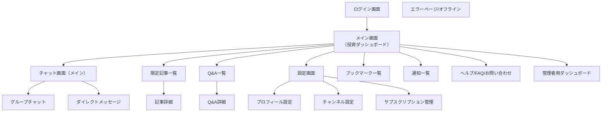
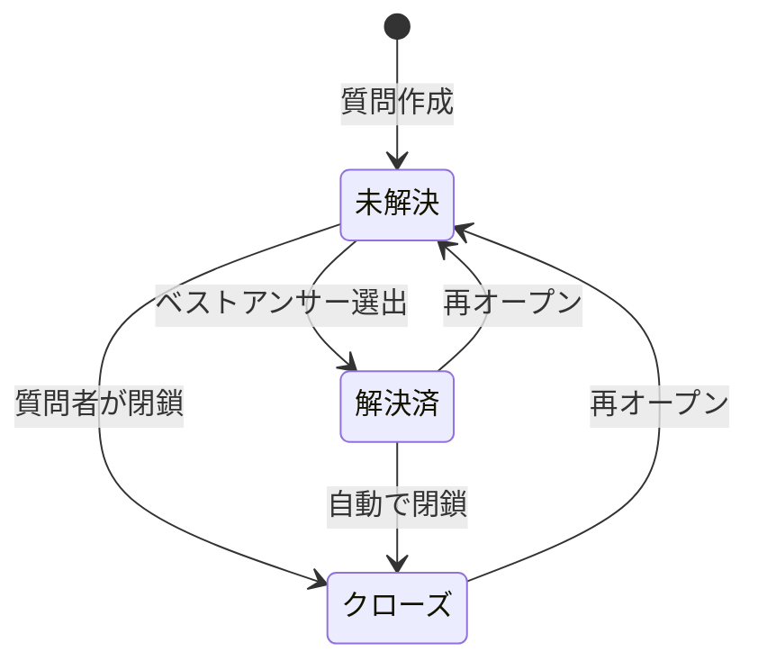

# UI_Layout

## 概要
投資コミュニティ向けチャットアプリケーション「すなっちゃん」の画面構成と設計図です。

## 画面遷移フロー

## 画面構成一覧

### 1. ログイン画面
#### 概要
- アプリの初回ログイン画面
#### 機能
- ウェルカムメッセージ（「ようこそ（コミュニティ名）へ！」）
- 米国個人投資家コミュニティの説明
- ログイン方法選択
    - Googleでログイン
    - Stripeでログイン
    - Xでログイン
- コミュニティロゴ表示

#### あとで考えること
- 初回導線
	- 利用規約／プライバシーポリシー同意チェック必須（ログイン完了時に Firestore に保存）
	- 年齢確認：ゲートが必要か要検討（投資関連サービスのため 18歳以上確認の可能性あり）

<!--  -->

### 2. メイン画面（投資ダッシュボード）
#### 概要
- ログイン後のメイン画面・投資情報ダッシュボード
#### 機能
- 「おかえりなさい、○○さん！」の挨拶
- サイドバーナビゲーション（ホーム、すなっちゃんの投資戦略、限定記事、顧客一覧）
- S&P500株価チャート（Overview）
- ハイライト（テクノロジー関連ニュース）
- Market Mover（上昇・下落銘柄）
- Your Favorites（お気に入り銘柄）
- Related News（関連ニュース）
- すなっちゃんの投資戦略ブログカード

#### あとで考えること
- データ鮮度
	- 各ウィジェットの更新間隔：初期ロード時取得 + 定期更新（例：60秒～5分）
	- ローディングUI：スケルトン表示 or ローディングインジケーター
	- キャッシュ方針：最新値優先（Firestoreキャッシュは fallback として利用）

### 3. チャット画面(メイン)
#### 3.1 グループチャット
##### 概要
- リアルタイムチャット画面
##### 機能
- チャンネル一覧（左サイドバー）
    - 複数チャンネル切り替え
- メッセージ送受信（テキスト・画像・リンク）
    - 画像・リンクのプレビュー共有
    - ファイル添付機能
- SNYDA（ボット）の自動投稿（BOTバッジ付き）
- リアクション機能
    - 複数投稿できる
    - リアクションとして画像追加ができる
- チャット履歴表示
- メッセージ入力エリア

##### あとで考えること
- 構造
    - チャンネル階層なし（フラット構造）
    - 未読件数バッジあり（最大99+表示）
- ロード
    - 履歴は無限スクロールで追加ロード
    - 未読位置へ自動スクロール
- 投下タイプ
    - テキスト：最大1,000文字
    - 画像：1投稿につき最大9枚、10MBまで
    - URL：プレビュー生成（タイトル＋サムネイル）
    - 絵文字／リアクション：最大10種類まで
- モデレーション
    - 通報／ミュート／ブロック可能
    - NGワード(自動マスクor送信不可)
    - 削除はログに残す（管理者確認可能）
- Bot投稿（SNYDA）
    - 投稿に「BOT」バッジを表示
    - ユーザー側でミュート可
    - 頻度上限：1時間に最大10件など制御
- リアルタイム
    - 既読数を表示
    - タイピング表示あり（参加者3人まで表示）
    - オフライン時：送信キューに保存し再接続後送信

#### やらないこと
- チャットルームの並び替え機能
- チャットルームのピン留め機能

<!--  -->

#### 3.2 DM（ダイレクトメッセージ）画面
##### 概要
- 1対1のプライベートチャット
##### 機能
- DMユーザー一覧（トム、ジャック、平子、酒井）
- 選択中のユーザーとの会話履歴
- メッセージ送受信
- 時刻表示
- いいねリアクション
- ファイル添付機能

##### あとで考えること
- スレッド／返信
	- 引用返信をサポート（引用は1段階まで）
	- 通報ボタンを各メッセージに設置

##### やらないこと
- ブロック機能
- 既読を付けないモード
- 相手既読の通知
- メッセージ取り消し／削除（双方・片方）

<!--  -->

### 4. 限定記事一覧画面
#### 概要
- すなっちゃん限定記事の一覧表示
#### 機能
- カテゴリータブ（最新、おすすめ、株式市場、個別銘柄、仮想通貨、テクノロジー、バイオ、経済、政治）
- サムネイル表示
    - タイトル
    - 概要
    - いいね数
    - 記事サムネイル画像
    - すなっちゃんブランディング

#### やらないこと
- フィルタ・並び替え
	- なし（常に新着順）
- カテゴリ体系
	- 固定カテゴリ（例：マーケット分析／銘柄ニュース／学習記事）
	- 並び順固定、折返しは考慮しない

<!--  -->

### 5. 記事詳細画面
#### 概要
- 個別記事の詳細表示
#### 機能
- 記事タイトル（例：「Klarna：失われた企業価値と復活劇」）
- 投稿日時表示
- 記事本文とメイン画像
- 関連記事セクション（おすすめの記事、最近の記事）
- コミュニティロゴ表示

#### あとで考えること
- シェア
    - OGP／X／LINE共有機能は 1st リリースでは非対応
	- 【NEXT_VERSION】今後検討する

#### やらないこと
- コメント
	- 実装しない（1st版では不要）

<!--  -->

### 6. Q&A・質問管理画面
#### 概要
- コミュニティ内のQ&A管理
#### 機能
- 「全ての質問」一覧表示
- 質問を追加ボタン
- カテゴリー選択ドロップダウン
- 質問ステータス表示（解決済み、未解決）
- 回答数表示
- 質問者プロフィール表示
- ページネーション

#### あとで考えること
- 状態遷移
	- 質問は「未解決」「解決済」
	- ベストアンサーを質問者が選択可能
	- 履歴は保存し、モデレーターも解決に変更可能
- 通知
	- 回答が付いたとき質問者へ通知
	- ベストアンサー選出時、回答者に通知
	- フォローしている質問も通知対象
- ベストアンサー制度を導入する
	- 質問解決の定義を「質問者がベストアンサーを選出した時点」とする

<!--  -->

### 7. ブックマーク画面
#### 概要: ユーザーがチャットメッセージを保存し、後から参照できる画面
- 機能:
    - メッセージのブックーマークアイコンで保存／解除
    - 保存したメッセージ一覧を表示（最新順）
    - 一覧から元のメッセージ位置へジャンプ
    - 記事の保存
    - 質問の保存
    - 保存解除（一覧からも可能）

<!--  -->

### 8. ヘルプ / FAQ / お問い合わせページ
##### 概要
- ユーザーの自己解決と運営連絡のためのサポートページ
##### 機能
- FAQ一覧（カテゴリ表示）
- 利用規約／プライバシーポリシーへのリンク
- お問い合わせ：Googleフォームへのリンク

### 9. 通知一覧ページ
##### 概要
- アプリ内通知を一元管理するページ
##### 機能
- 未読／既読の切替
- 種別フィルタ（チャット／Q&A／記事／サブスク）
- 通知クリックで関連画面へ遷移
- すべて既読にする

### 10. 管理者用ダッシュボード（モデレーター／管理者向け）
##### 概要
- ユーザー・コンテンツを管理する運営用ページ
##### 機能
- ユーザー管理
    - ユーザー一覧（検索・フィルタ）
    - 基本情報（名前／メール／登録日／サブスク状態）
    - 権限変更（Owner/Member）
    - アカウント状態（有効／停止）
    - 強制退会機能
    - 招待コード／リンク発行
- ボット管理（SNYDA設定／実行状況）
- 設定（規約・ポリシー更新）

#### ダッシュボードではなく各画面でできる「管理者権限」機能
1. 通報管理
- 投稿削除／クローズ
2. コンテンツ管理
- 強制削除／クローズ／非公開化

### 11. エラーページ／オフラインページ
##### 概要
- アクセス不可や通信断発生時の案内ページ
##### 機能
- 404／権限エラー（有料コンテンツ等）の専用表示
- 再読み込みボタン
- オフライン時の案内（利用可能範囲の表示／復帰時の自動再試行）

### 12. 設定画面
#### 12.1 プロフィール設定画面
###### 概要
- ユーザープロフィール編集画面
###### 機能
- プロフィール写真のアップロード
- 氏名、表示名入力フィールド
- 自己紹介テキストエリア
- メールアドレス設定
- サブスクリプション管理
- 変更を保存ボタン

##### あとで考えること
- 項目制約
	- 表示名：最大20文字、重複不可、NGワードリストでフィルタ
	- 自己紹介：最大200文字、リンク（http/https）は許可
- メールアドレス
	- ログインしているアカウントのメールアドレスを表示のみ（編集不可）
- サブスク連携
	- 現在のプラン名・更新日を表示
	- 表示場所：プロフィール画面に含めるか、専用「サブスク管理画面」に分離するか後で決定

<!--  -->

#### 12.2 チャンネル設定画面
###### 概要
- チャンネル通知設定画面
###### 機能
- プロフィール、チャンネル、サブスクリプションタブ
- 複数チャンネルの通知ON/OFF切り替え
- 各チャンネルの通知設定（緑色トグルスイッチ）
- 変更を保存ボタン

##### あとで考えること
- 保存戦略
	- 設定変更は即時保存（Firestoreに直接反映）
	- 保存失敗時：トーストでエラー通知、リトライ可能
- 権限
	- 参加していないチャンネルはリスト非表示
	- 有料限定チャンネルも非表示

##### やらないこと
- 通知粒度（@mention／キーワード通知の個別設定）

<!--  -->

#### 12.3 サブスクリプション管理画面
###### 概要
- 月額課金・サブスクリプション管理
###### 機能
- プラン名表示（すなっちゃんコミュニティダイヤモンドプラン）
- プラン変更ボタン
- 支払い方法（クレジットカード）
- 支払い方法変更ボタン
- 次回決済日と金額表示（2025/9/1 ¥1,500）
- 退会するボタン

##### あとで考えること
- UI
	- Stripe Customer Portal へ遷移して変更／解約を行う
	- アプリ側では閲覧のみ（プラン名／次回決済日）

<!--  -->

## 全般
### ロール設計

| 機能 | Owner | Member |
| --- | --- | --- |
| ユーザー招待／削除 | ○ | × |
| チャンネル作成／削除 | ○ | × |
| 投稿削除（他人の） | ○ | × |
| モデレーション（通報対応） | ○ | × |
| 記事投稿 | ○ | × |
| Q&A回答／ベストアンサー選出 | ○ | ○ |
| サブスク管理 | ○ | × |
| 閲覧（チャット／記事／Q&A） | ○ | ○ |

### 検索
- チャット／記事／Q&Aは共通検索バーを利用する

### 認証／課金まわり
- 認証
	- Googleログインを検討
        - 理由：ユーザー利用率が高く、開発・審査コストが比較的低い
	- Xログインは対応しない
        - 理由: 審査・維持コストが高いため
- 課金UI
	- サブスク変更や解約は Stripe Customer Portal へ遷移する

### ボット機能
##### 概要
- チャットに自動で投資情報やメッセージを投稿するボット機能
##### 機能
- ボット一覧（稼働中/停止中の表示）
- 新規ボット作成（名前、説明、トリガー、アクション）
- 実行履歴（成功/失敗、結果プレビュー）
- ボット編集・削除・有効化/無効化
- 投稿アクション（テキスト、画像、外部API連携）
- スケジュール実行（cron式）と手動実行

### デザインシステム

#### カラーパレット
- メインカラー
    - オレンジ(#dc6711)
- サイドバー
    - 薄オレンジ(#ffe8d3)
- 背景
    - 薄いベージュ(#fffdfc)
- 一番上のバー
    - グレー(#efefef)
- タイトルフォント
    - ライトグレー(#808080)
- 通常フォント
    - ダークグレー(#575555)

### 共通要素
- **角丸**: 4px
- **影効果**: 複数レイヤーの影
  - `0px 2px 6px 0px rgba(0, 0, 0, 0.1)`
  - `0px 0px 2px 0px rgba(0, 0, 0, 0.08)`
  - `0px 0px 0px 1px rgba(0, 0, 0, 0.2)`
- **枠線**: 8px 白色

### レスポンシブ対応
- **モバイル**: 320px〜768px
- **タブレット**: 768px〜1024px
- **デスクトップ**: 1024px以上

## 後で考えること（全体）
- チャットルームの種類
    - 「ひとりごと」や「掲示板」とか色々あるけど制約？やルールはどのように具体化しようかな