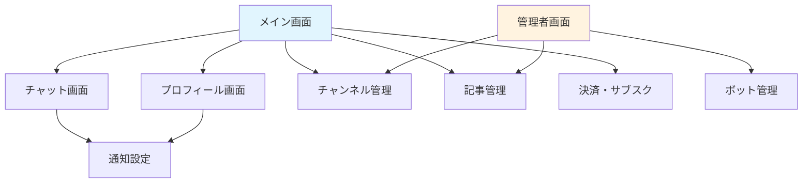

# すなっちゃんアプリ - 画面構成図

## 概要
投資コミュニティ向けチャットアプリケーション「すなっちゃん」の画面構成と設計図です。

## 画面構成一覧

### 1. Image 1 - メイン画面
- **実際のサイズ**: 1223 × 817px（ダウンロード時）
- **ファイル名**: image1
- **概要**: アプリのメイン画面・ダッシュボード
- **機能**:
  - ダッシュボード表示
  - ナビゲーションメニュー
  - 投資情報の概要表示
  - ユーザー情報表示

### 2. Image 2 - チャット画面
- **実際のサイズ**: 1156 × 864px（ダウンロード時）
- **ファイル名**: image2
- **概要**: リアルタイムチャット機能
- **機能**:
  - メッセージ送受信
  - ファイル添付
  - リアクション機能
  - スレッド表示

### 3. Image 3 - プロフィール/設定画面
- **実際のサイズ**: 1156 × 864px（ダウンロード時）
- **ファイル名**: image3.png
- **概要**: ユーザープロフィール・設定管理
- **機能**:
  - プロフィール情報表示・編集
  - X（Twitter）連携状況
  - アバター設定
  - アカウント設定

### 4. Image 4 - 詳細設計・アーキテクチャ図
- **実際のサイズ**: 739 × 1352px（縦長・ダウンロード時）
- **ファイル名**: image4.png
- **概要**: アプリ全体の詳細設計資料
- **内容**:
  - システムアーキテクチャ図
  - データフロー図
  - 技術スタック詳細
  - API設計仕様

### 5. Image 5 - チャンネル管理画面（Node ID: 2:113）
- **実際のサイズ**: 1086 × 920px（ダウンロード時）
- **ファイル名**: image5.png
- **概要**: チャンネル作成・管理機能
- **機能**:
  - チャンネル一覧表示
  - パブリック/プライベート設定
  - メンバー管理
  - 権限設定

### 6. Image 6 - 記事・コンテンツ管理画面（Node ID: 2:123）
- **実際のサイズ**: 1068 × 935px（ダウンロード時）
- **ファイル名**: image6.png
- **概要**: 投資記事・コンテンツの管理
- **機能**:
  - 記事一覧表示
  - 記事作成・編集（管理者）
  - いいね・コメント機能
  - カテゴリー・タグ管理

### 7. Image 7 - 通知・設定画面（Node ID: 2:127）
- **実際のサイズ**: 1068 × 936px（ダウンロード時）
- **ファイル名**: image7.png
- **概要**: 通知機能の詳細設定
- **機能**:
  - プッシュ通知設定
  - 通知カテゴリー選択
  - 時間帯設定
  - 通知履歴表示

### 8. Image 8 - ボット・自動化機能画面（Node ID: 2:131）
- **実際のサイズ**: 1091 × 915px（ダウンロード時）
- **ファイル名**: image8.png
- **概要**: ボット機能と自動化管理
- **機能**:
  - ボット一覧表示
  - 自動投稿設定
  - Webhook連携設定
  - スケジュール管理

### 9. Image 9 - 決済・サブスクリプション画面（Node ID: 2:139）
- **実際のサイズ**: 1071 × 933px（ダウンロード時）
- **ファイル名**: image9.png
- **概要**: 決済とサブスクリプション管理
- **機能**:
  - プラン選択・比較
  - Stripe決済処理
  - 請求履歴表示
  - プラン変更・キャンセル

### 10. Image 10 - 管理者・運営画面（Node ID: 2:143）
- **実際のサイズ**: 1044 × 956px（ダウンロード時）
- **ファイル名**: image10.png
- **概要**: システム管理・運営機能
- **機能**:
  - ユーザー管理・権限変更
  - システム設定
  - レポート生成・分析
  - ログ管理・監視

## 画面遷移フロー

## デザインシステム

### 共通要素
- **角丸**: 4px
- **影効果**: 複数レイヤーの影
  - `0px 2px 6px 0px rgba(0, 0, 0, 0.1)`
  - `0px 0px 2px 0px rgba(0, 0, 0, 0.08)`
  - `0px 0px 0px 1px rgba(0, 0, 0, 0.2)`
- **枠線**: 8px 白色

### レスポンシブ対応
- **モバイル**: 320px〜768px
- **タブレット**: 768px〜1024px
- **デスクトップ**: 1024px以上

## 技術仕様

### フロントエンド
- **フレームワーク**: React + Redux
- **UI ライブラリ**: Material-UI または独自コンポーネント
- **レスポンシブ**: CSS Grid + Flexbox

### バックエンド連携
- **認証**: X（Twitter）OAuth2.0
- **リアルタイム**: WebSocket (Socket.io)
- **API**: REST + GraphQL

## 実装優先度

### Phase 1（高優先度）
1. メイン画面
2. チャット画面
3. プロフィール画面
4. 認証機能

### Phase 2（中優先度）
5. チャンネル管理画面
6. 記事管理画面
7. 通知設定画面

### Phase 3（低優先度）
8. ボット管理画面
9. 決済・サブスクリプション画面
10. 管理者画面

## 開発ガイドライン

1. **モバイルファースト**: モバイル画面から設計・実装
2. **アクセシビリティ**: WCAG 2.1 AA準拠
3. **パフォーマンス**: 初回ロード3秒以内
4. **ユーザビリティ**: 直感的な操作性を重視

## Figma画像詳細情報

### ダウンロード画像一覧
1. **image1.png** (1223×817px) - Node ID: 2:93
2. **image2.png** (1156×864px) - Node ID: 2:95
3. **image3.png** (1156×864px) - Node ID: 2:96
4. **image4.png** (739×1352px) - Node ID: 2:106
5. **image5.png** (1086×920px) - Node ID: 2:113
6. **image6.png** (1068×935px) - Node ID: 2:123
7. **image7.png** (1068×936px) - Node ID: 2:127
8. **image8.png** (1091×915px) - Node ID: 2:131
9. **image9.png** (1071×933px) - Node ID: 2:139
10. **image10.png** (1044×956px) - Node ID: 2:143

### 画像ファイル参照
- すべての画像ファイルは `docs/figma_images/` ディレクトリに保存予定
- ファイル名はnode IDと対応
- image9のみ異なるsuffix (77edf7) を使用
- **各画像の具体的な内容は対応するNode IDとファイル名で特定可能**

---

*最終更新: 2025年9月23日*
*Figmaボード: [すなっちゃんアプリ開発](https://www.figma.com/board/rzMePnfiecr1VUOVzUr8LC)*
*画像ダウンロード: 2025年9月23日実施*
