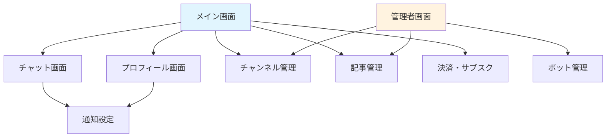

# すなっちゃんアプリ - 画面構成図

## 概要
投資コミュニティ向けチャットアプリケーション「すなっちゃん」の画面構成と設計図です。

## 画面構成一覧

### 1. メイン画面（image 1）
- **サイズ**: 718.53 × 480px
- **概要**: アプリのメイン画面
- **機能**:
  - ダッシュボード表示
  - ナビゲーションメニュー
  - 投資情報の概要表示

### 2. チャット画面（image 2）
- **サイズ**: 642.22 × 480px
- **概要**: リアルタイムチャット機能
- **機能**:
  - メッセージ送受信
  - ファイル添付
  - リアクション機能
  - スレッド表示

### 3. プロフィール画面（image 3）
- **サイズ**: 642.22 × 480px
- **概要**: ユーザープロフィール管理
- **機能**:
  - プロフィール情報表示・編集
  - X（Twitter）連携状況
  - アバター設定

### 4. 詳細設計図（image 4）
- **サイズ**: 718.53 × 1314.55px（縦長）
- **概要**: アプリ全体の詳細設計資料
- **内容**:
  - 画面遷移図
  - データフロー
  - 技術アーキテクチャ
  - API設計

### 5. チャンネル管理画面（image 5）
- **サイズ**: 566.61 × 480px
- **概要**: チャンネル作成・管理
- **機能**:
  - チャンネル一覧表示
  - パブリック/プライベート設定
  - メンバー管理
  - 権限設定

### 6. 記事管理画面（image 6）
- **サイズ**: 548.28 × 480px
- **概要**: 投資記事の管理
- **機能**:
  - 記事一覧表示
  - 記事作成・編集（管理者）
  - いいね・コメント機能
  - カテゴリー管理

### 7. 通知設定画面（image 7）
- **サイズ**: 547.69 × 480px
- **概要**: 通知機能の設定
- **機能**:
  - プッシュ通知設定
  - 通知カテゴリー選択
  - 時間帯設定
  - 通知履歴

### 8. ボット管理画面（image 8）
- **サイズ**: 572.33 × 480px
- **概要**: ボット機能の管理
- **機能**:
  - ボット一覧表示
  - 自動投稿設定
  - Webhook連携
  - スケジュール管理

### 9. 決済・サブスクリプション画面（image 9）
- **サイズ**: 551 × 480px
- **概要**: 決済とサブスクリプション管理
- **機能**:
  - プラン選択
  - Stripe決済
  - 請求履歴
  - プラン変更・キャンセル

### 10. 管理者画面（image 10）
- **サイズ**: 524.18 × 480px
- **概要**: システム管理機能
- **機能**:
  - ユーザー管理
  - システム設定
  - レポート生成
  - ログ管理

## 画面遷移フロー

## デザインシステム

### 共通要素
- **角丸**: 4px
- **影効果**: 複数レイヤーの影
  - `0px 2px 6px 0px rgba(0, 0, 0, 0.1)`
  - `0px 0px 2px 0px rgba(0, 0, 0, 0.08)`
  - `0px 0px 0px 1px rgba(0, 0, 0, 0.2)`
- **枠線**: 8px 白色

### レスポンシブ対応
- **モバイル**: 320px〜768px
- **タブレット**: 768px〜1024px
- **デスクトップ**: 1024px以上

## 技術仕様

### フロントエンド
- **フレームワーク**: React + Redux
- **UI ライブラリ**: Material-UI または独自コンポーネント
- **レスポンシブ**: CSS Grid + Flexbox

### バックエンド連携
- **認証**: X（Twitter）OAuth2.0
- **リアルタイム**: WebSocket (Socket.io)
- **API**: REST + GraphQL

## 実装優先度

### Phase 1（高優先度）
1. メイン画面
2. チャット画面
3. プロフィール画面
4. 認証機能

### Phase 2（中優先度）
5. チャンネル管理画面
6. 記事管理画面
7. 通知設定画面

### Phase 3（低優先度）
8. ボット管理画面
9. 決済・サブスクリプション画面
10. 管理者画面

## 開発ガイドライン

1. **モバイルファースト**: モバイル画面から設計・実装
2. **アクセシビリティ**: WCAG 2.1 AA準拠
3. **パフォーマンス**: 初回ロード3秒以内
4. **ユーザビリティ**: 直感的な操作性を重視

---

*最終更新: 2025年9月23日*
*Figmaボード: [すなっちゃんアプリ開発](https://www.figma.com/board/rzMePnfiecr1VUOVzUr8LC)*